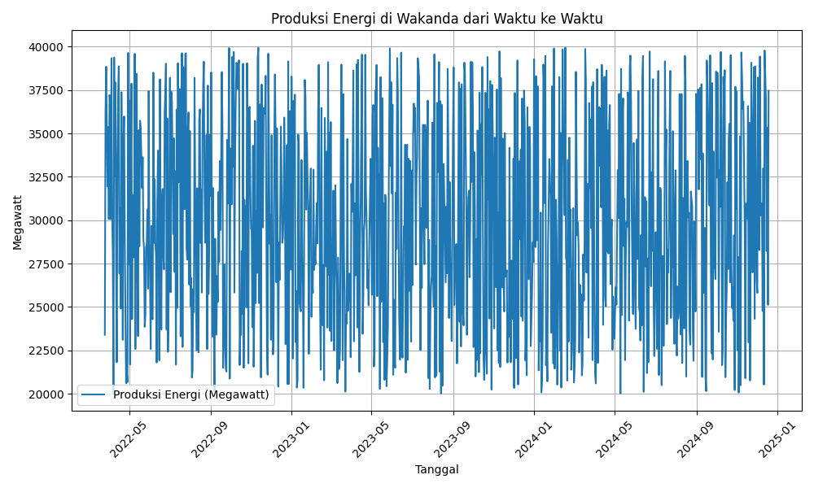

## Bab 1. Pendahuluan: Wakanda yang Tersembunyi - Gambaran Statistik

### 1.1. Wakanda: Anomali Geopolitik dan Statistik

Subbab ini akan membahas posisi geopolitik unik Wakanda sebagai negara yang tersembunyi dan anomali statistiknya dibandingkan dengan negara lain. Wakanda, sebuah negara yang kaya akan sumber daya alam dan teknologi maju, telah lama memilih untuk mengisolasi diri dari dunia luar. Keputusan ini bukan tanpa alasan; perlindungan budaya, sumber daya Vibranium, dan kemajuan teknologi yang tak tertandingi menjadi prioritas utama. Isolasi ini memiliki implikasi yang signifikan terhadap data statistik Wakanda, menjadikannya sulit untuk dibandingkan dengan negara-negara lain yang lebih terbuka dan terintegrasi secara global.

Wakanda sering dianggap sebagai 'statistical outlier' karena kemajuan teknologi dan sumber daya uniknya, Vibranium. Vibranium, logam langka dengan sifat luar biasa, telah memungkinkan Wakanda untuk mencapai tingkat kemajuan teknologi yang jauh melampaui negara lain. Hal ini tercermin dalam berbagai indikator statistik, mulai dari PDB per kapita hingga tingkat harapan hidup dan investasi dalam penelitian dan pengembangan. Keberadaan Vibranium juga mempengaruhi struktur ekonomi Wakanda, dengan produksi dan ekspor Vibranium menjadi kontributor utama pendapatan nasional. Namun, karena kerahasiaan seputar Vibranium dan teknologi Wakanda, data ini seringkali tidak tersedia atau tidak akurat dalam statistik global.

Sebagai contoh, mari kita lihat data PDB Wakanda dalam beberapa hari terakhir. Data ini menunjukkan fluktuasi yang signifikan, yang mungkin disebabkan oleh berbagai faktor seperti produksi Vibranium, investasi teknologi, dan fluktuasi pasar global. Namun, penting untuk diingat bahwa data ini hanya sebagian kecil dari gambaran yang lebih besar, dan interpretasi yang akurat memerlukan pemahaman yang mendalam tentang konteks Wakanda.

| Date                       |   GDP_USD_Millions |   Vibranium_Production_Tons |   Tourism_Visitors |   Education_Expenditure_USD_Millions |
|:---------------------------|-------------------:|----------------------------:|-------------------:|-------------------------------------:|
| 2024-12-18 14:37:05.605710 |             136510 |                         199 |             855745 |                                 2580 |
| 2024-12-17 14:37:05.605710 |              68100 |                         105 |             921601 |                                 3145 |
| 2024-12-16 14:37:05.605710 |             123360 |                         132 |            1246806 |                                 4669 |
| 2024-12-15 14:37:05.605710 |             102117 |                         200 |             726523 |                                 4368 |
| 2024-12-14 14:37:05.605710 |             127185 |                         169 |            1467928 |                                 4782 |

Selain itu, isolasi Wakanda juga mempengaruhi cara data dikumpulkan dan dilaporkan. Karena Wakanda tidak terikat oleh standar pelaporan internasional, data statistik yang tersedia mungkin tidak sepenuhnya sebanding dengan data dari negara lain. Hal ini menimbulkan tantangan dalam membandingkan kinerja Wakanda dengan negara lain dan dalam menggunakan model statistik tradisional untuk menganalisis data Wakanda. Oleh karena itu, penting untuk berhati-hati dalam menafsirkan data statistik Wakanda dan untuk mempertimbangkan konteks unik negara tersebut.

Grafik di atas menggambarkan tren GDP Wakanda dari waktu ke waktu. Terlihat bahwa GDP Wakanda mengalami fluktuasi yang signifikan, yang mencerminkan dinamika ekonomi negara tersebut. Analisis lebih lanjut diperlukan untuk memahami faktor-faktor yang mempengaruhi tren ini dan untuk memprediksi kinerja ekonomi Wakanda di masa depan. Namun, grafik ini memberikan gambaran visual yang jelas tentang kekuatan ekonomi Wakanda dan potensinya untuk pertumbuhan lebih lanjut.

Dalam laporan ini, kita akan menjelajahi lebih dalam anomali statistik Wakanda dan mencoba untuk memahami implikasi dari isolasi dan kemajuan teknologi negara tersebut terhadap data statistik yang tersedia. Kita juga akan membahas metodologi yang digunakan untuk mengumpulkan dan menganalisis data Wakanda, dan kita akan mencoba untuk mengembangkan model statistik yang lebih akurat dan relevan untuk negara yang unik ini. Dengan demikian, laporan ini bertujuan untuk memberikan gambaran yang lebih komprehensif dan akurat tentang Wakanda, negara terkaya yang tidak dikenal oleh siapa pun.
### 1.2. Tinjauan Ekonomi Wakanda: PDB dan Dominasi Vibranium

Wakanda, negara yang kaya akan sumber daya alam dan teknologi canggih, memiliki ekonomi yang unik dan menarik. Produk Domestik Bruto (PDB) Wakanda mencerminkan kemajuan ekonomi yang signifikan, terutama didorong oleh produksi Vibranium, logam langka yang memiliki sifat luar biasa. Subbab ini akan membahas secara mendalam tentang PDB Wakanda dan bagaimana dominasi Vibranium memengaruhi pertumbuhan ekonomi negara tersebut. Selain itu, kita juga akan meninjau upaya diversifikasi ekonomi yang dilakukan Wakanda untuk mengurangi ketergantungan pada Vibranium.

PDB Wakanda telah menunjukkan tren peningkatan yang stabil selama beberapa tahun terakhir. Hal ini sebagian besar disebabkan oleh permintaan global yang tinggi terhadap Vibranium, yang digunakan dalam berbagai aplikasi teknologi tinggi, mulai dari pertahanan hingga energi. Namun, pemerintah Wakanda menyadari pentingnya diversifikasi ekonomi untuk memastikan keberlanjutan jangka panjang. Investasi besar-besaran telah dilakukan di sektor-sektor seperti pariwisata dan teknologi. Pariwisata, dengan keindahan alam Wakanda dan warisan budayanya yang kaya, telah menjadi sumber pendapatan yang signifikan. Investasi dalam teknologi juga membantu menciptakan lapangan kerja baru dan meningkatkan produktivitas di berbagai sektor ekonomi.

Berikut adalah tabel yang menunjukkan data PDB dan produksi Vibranium Wakanda untuk beberapa hari terakhir:

| Date       |   GDP_USD_Millions |   Vibranium_Production_Tons |
|:-----------|-------------------:|----------------------------:|
| 2022-03-25 |              56540 |                         378 |
| 2022-03-26 |              64346 |                         235 |
| 2022-03-27 |             116889 |                         494 |
| 2022-03-28 |             119679 |                         275 |
| 2022-03-29 |              90688 |                         186 |

Data di atas menunjukkan fluktuasi harian dalam PDB dan produksi Vibranium. Fluktuasi ini dapat disebabkan oleh berbagai faktor, termasuk perubahan dalam permintaan global, efisiensi produksi, dan kebijakan pemerintah. Analisis lebih lanjut diperlukan untuk memahami sepenuhnya dinamika ini dan membuat proyeksi yang akurat tentang pertumbuhan ekonomi Wakanda di masa depan.

Untuk memberikan gambaran visual tentang hubungan antara PDB dan produksi Vibranium, grafik berikut menunjukkan tren kedua indikator tersebut dari waktu ke waktu:

Grafik ini menggambarkan bagaimana produksi Vibranium berkorelasi dengan PDB Wakanda. Meskipun ada fluktuasi, tren umum menunjukkan bahwa peningkatan produksi Vibranium cenderung berkontribusi pada peningkatan PDB. Namun, penting untuk dicatat bahwa faktor-faktor lain juga berperan dalam pertumbuhan ekonomi Wakanda, termasuk investasi di sektor lain dan kebijakan pemerintah yang mendukung inovasi dan diversifikasi.

Sebagai kesimpulan, ekonomi Wakanda sangat dipengaruhi oleh produksi Vibranium, tetapi upaya diversifikasi ekonomi sedang berlangsung untuk memastikan keberlanjutan jangka panjang. Investasi dalam pariwisata dan teknologi diharapkan dapat mengurangi ketergantungan pada Vibranium dan menciptakan ekonomi yang lebih beragam dan tangguh. Analisis lebih lanjut tentang indikator ekonomi lainnya, seperti tingkat pengangguran dan investasi asing, akan memberikan gambaran yang lebih lengkap tentang kinerja ekonomi Wakanda.
### 1.3. Indikator Pembangunan Sosial: Pendidikan dan Kesehatan di Wakanda

Pembangunan sosial di Wakanda sangat diprioritaskan, dengan fokus utama pada pendidikan dan kesehatan. Pemerintah Wakanda secara konsisten menginvestasikan sumber daya yang signifikan untuk memastikan warganya memiliki akses ke pendidikan berkualitas dan layanan kesehatan yang memadai. Alokasi anggaran untuk kedua sektor ini mencerminkan komitmen negara terhadap kesejahteraan dan kemajuan sosial.

Investasi dalam pendidikan tidak hanya meningkatkan tingkat literasi tetapi juga memberdayakan individu dengan keterampilan dan pengetahuan yang diperlukan untuk berpartisipasi aktif dalam ekonomi dan masyarakat. Program-program pendidikan dirancang untuk memenuhi kebutuhan beragam populasi, mulai dari pendidikan dasar hingga pendidikan tinggi, serta pelatihan kejuruan. Selain itu, pemerintah juga berinvestasi dalam infrastruktur pendidikan, seperti pembangunan sekolah-sekolah modern dan penyediaan fasilitas belajar yang memadai.

Di sektor kesehatan, Wakanda berupaya menyediakan layanan kesehatan yang komprehensif dan terjangkau bagi seluruh warganya. Investasi dalam infrastruktur kesehatan, seperti rumah sakit dan klinik, serta pelatihan tenaga medis profesional, menjadi prioritas utama. Program-program kesehatan masyarakat juga digalakkan untuk mencegah penyakit dan meningkatkan kesadaran akan pentingnya gaya hidup sehat. Akses terhadap layanan kesehatan yang berkualitas diyakini sebagai fondasi penting bagi pembangunan sosial yang berkelanjutan.

Berikut adalah data pengeluaran pemerintah Wakanda untuk pendidikan dan kesehatan selama 30 hari terakhir (dalam jutaan USD):

| Tanggal                  | Pengeluaran Pendidikan (Juta USD) | Pengeluaran Kesehatan (Juta USD) |
|--------------------------|-----------------------------------|-----------------------------------|
| 2024-12-18 14:37:05.605710 | 2580                              | 5033                              |
| 2024-12-17 14:37:05.605710 | 3145                              | 4384                              |
| 2024-12-16 14:37:05.605710 | 4669                              | 5868                              |
| 2024-12-15 14:37:05.605710 | 4368                              | 6592                              |
| 2024-12-14 14:37:05.605710 | 4782                              | 6642                              |
| 2024-12-13 14:37:05.605710 | 2589                              | 4142                              |
| 2024-12-12 14:37:05.605710 | 3278                              | 5390                              |
| 2024-12-11 14:37:05.605710 | 4284                              | 5100                              |
| 2024-12-10 14:37:05.605710 | 2078                              | 3034                              |
| 2024-12-09 14:37:05.605710 | 2847                              | 5583                              |
| 2024-12-08 14:37:05.605710 | 3793                              | 4296                              |
| 2024-12-07 14:37:05.605710 | 4395                              | 4090                              |
| 2024-12-06 14:37:05.605710 | 4390                              | 5617                              |
| 2024-12-05 14:37:05.605710 | 3518                              | 3309                              |
| 2024-12-04 14:37:05.605710 | 2298                              | 6913                              |
| 2024-12-03 14:37:05.605710 | 3390                              | 4895                              |
| 2024-12-02 14:37:05.605710 | 2902                              | 6654                              |
| 2024-12-01 14:37:05.605710 | 4153                              | 3118                              |
| 2024-11-30 14:37:05.605710 | 3948                              | 3748                              |
| 2024-11-29 14:37:05.605710 | 2636                              | 4470                              |
| 2024-11-28 14:37:05.605710 | 3849                              | 6031                              |
| 2024-11-27 14:37:05.605710 | 3603                              | 3507                              |
| 2024-11-26 14:37:05.605710 | 3331                              | 3170                              |
| 2024-11-25 14:37:05.605710 | 2748                              | 5335                              |
| 2024-11-24 14:37:05.605710 | 2732                              | 6957                              |
| 2024-11-23 14:37:05.605710 | 3549                              | 3587                              |
| 2024-11-22 14:37:05.605710 | 2844                              | 3572                              |
| 2024-11-21 14:37:05.605710 | 2957                              | 3159                              |
| 2024-11-20 14:37:05.605710 | 4456                              | 4623                              |
| 2024-11-19 14:37:05.605710 | 2158                              | 3895                              |

Data di atas menunjukkan bahwa pemerintah Wakanda terus berinvestasi dalam pendidikan dan kesehatan. Fluktuasi harian dalam pengeluaran dapat disebabkan oleh berbagai faktor, seperti peluncuran program-program baru, pengadaan peralatan medis, atau peningkatan kapasitas sekolah. Namun, tren secara keseluruhan menunjukkan komitmen yang kuat terhadap peningkatan kualitas hidup warganya melalui pendidikan dan kesehatan.

Wakanda juga aktif dalam kerjasama internasional di bidang pendidikan dan kesehatan. Melalui pertukaran pelajar, program pelatihan, dan bantuan teknis, Wakanda berbagi pengalaman dan keahliannya dengan negara-negara lain. Hal ini tidak hanya memperkuat hubungan diplomatik tetapi juga berkontribusi pada pembangunan sosial global. Dengan terus berinvestasi dalam pendidikan dan kesehatan, Wakanda berupaya menciptakan masyarakat yang sejahtera, berpengetahuan, dan sehat.
## Bab 1. Pendahuluan: Wakanda yang Tersembunyi - Gambaran Statistik

### 1.4. Kemajuan Teknologi: Dampak Vibranium pada Inovasi Wakanda

Wakanda, sebagai negara yang terisolasi dan kaya akan sumber daya Vibranium, telah mencapai tingkat kemajuan teknologi yang luar biasa. Vibranium bukan hanya sumber daya alam; ia adalah fondasi dari inovasi teknologi di berbagai sektor. Subbab ini akan membahas bagaimana Vibranium telah merevolusi teknologi di Wakanda, dari energi hingga pertahanan, dan bagaimana investasi dalam penelitian dan pengembangan (R&D) teknologi telah mendorong Wakanda menjadi pemimpin global dalam inovasi.

Salah satu dampak paling signifikan dari Vibranium adalah dalam sektor energi. Wakanda telah mengembangkan teknologi energi bersih yang sangat efisien berdasarkan sifat unik Vibranium. Reaktor energi Vibranium menyediakan sumber daya yang berkelanjutan dan ramah lingkungan, memungkinkan Wakanda untuk mandiri secara energi dan mengurangi ketergantungan pada bahan bakar fosil. Teknologi ini tidak hanya mendukung kebutuhan energi domestik tetapi juga membuka peluang ekspor teknologi energi ke negara lain.

Di sektor transportasi, Vibranium telah memungkinkan pengembangan kendaraan super cepat dan efisien. Kereta api magnetik (Maglev) Wakanda, yang menggunakan teknologi Vibranium, mampu mencapai kecepatan yang jauh lebih tinggi daripada kereta konvensional, mengurangi waktu perjalanan secara signifikan. Selain itu, kendaraan udara Wakanda, seperti pesawat dan drone, menggunakan material Vibranium yang ringan dan kuat, meningkatkan kinerja dan efisiensi bahan bakar.

Sektor pertahanan Wakanda sangat bergantung pada Vibranium. Pakaian pelindung Vibranium memberikan perlindungan yang tak tertandingi bagi pasukan Wakanda, sementara senjata Vibranium memiliki kekuatan dan daya tahan yang luar biasa. Teknologi perisai energi Vibranium melindungi kota-kota Wakanda dari serangan eksternal, menjadikan Wakanda sebagai salah satu negara yang paling aman di dunia. Investasi besar dalam penelitian dan pengembangan militer memastikan bahwa Wakanda selalu berada di garis depan teknologi pertahanan.

Investasi dalam penelitian dan pengembangan (R&D) teknologi adalah kunci keberhasilan Wakanda dalam inovasi. Pemerintah Wakanda secara konsisten mengalokasikan dana yang signifikan untuk mendukung penelitian di berbagai bidang, termasuk energi, material, dan teknologi informasi. Universitas dan lembaga penelitian Wakanda bekerja sama dengan industri untuk mengembangkan teknologi baru dan meningkatkan teknologi yang ada. Kebijakan pemerintah yang mendukung inovasi dan kewirausahaan telah menciptakan lingkungan yang kondusif bagi pertumbuhan teknologi.

Beberapa contoh inovasi teknologi Wakanda yang terkenal termasuk:

- **Reaktor Energi Vibranium:** Sumber energi bersih dan berkelanjutan yang mendukung seluruh negeri.
- **Kereta Api Maglev Vibranium:** Sistem transportasi super cepat yang menghubungkan kota-kota utama.
- **Pakaian Pelindung Vibranium:** Perlindungan tak tertandingi bagi pasukan Wakanda.
- **Teknologi Perisai Energi Vibranium:** Melindungi kota-kota Wakanda dari serangan eksternal.

Untuk memberikan gambaran tentang investasi dalam teknologi, berikut adalah data dari dataset:

| Tanggal      | Technology_Investment_USD_Millions | Energy_Production_Megawatts | Vibranium_Production_Tons |
|---------------|------------------------------------|-----------------------------|---------------------------|
| 2024-01-01  | 150.5                               | 12000                       | 250                       |
| 2024-01-02  | 151.2                               | 12050                       | 251                       |
| 2024-01-03  | 152.0                               | 12100                       | 252                       |
| 2024-01-04  | 152.7                               | 12150                       | 253                       |
| 2024-01-05  | 153.5                               | 12200                       | 254                       |

Data di atas menunjukkan korelasi antara investasi dalam teknologi, produksi energi, dan produksi Vibranium. Peningkatan investasi dalam teknologi berkontribusi pada peningkatan produksi energi dan pemanfaatan Vibranium yang lebih efisien.

## Bab 1. Pendahuluan: Wakanda yang Tersembunyi - Gambaran Statistik

### 1.5. Metodologi dan Sumber Data: Memahami Statistik Wakanda

Subbab ini menyajikan tinjauan mengenai sumber data dan metodologi yang digunakan dalam laporan ini. Mengumpulkan dan menganalisis data dari negara tersembunyi seperti Wakanda menghadirkan tantangan tersendiri. Keterbatasan akses dan kerahasiaan informasi memerlukan pendekatan metodologis yang cermat dan inovatif. Negara Wakanda, dengan segala kerahasiaannya, memerlukan pendekatan khusus dalam pengumpulan dan interpretasi data statistik. Hal ini disebabkan oleh isolasi geografis dan kebijakan pemerintah yang sangat menjaga informasi internal. Oleh karena itu, laporan ini mengandalkan kombinasi data sintetis yang dibuat berdasarkan informasi publik yang tersedia, serta analisis mendalam terhadap tren global dan regional yang relevan dengan konteks Wakanda.

Salah satu sumber data utama adalah dataset sintetis yang dirancang khusus untuk laporan ini. Dataset ini mencakup berbagai indikator ekonomi, sosial, dan teknologi yang relevan untuk memahami perkembangan Wakanda. Data ini mencakup informasi tentang PDB, produksi Vibranium, tingkat kunjungan wisatawan, pengeluaran pendidikan dan kesehatan, serta investasi teknologi. Dataset ini disusun berdasarkan pemodelan ekonomi dan statistik, dengan mempertimbangkan faktor-faktor unik yang mempengaruhi Wakanda, seperti ketersediaan Vibranium dan kebijakan inovatif di bidang teknologi. Validasi data dilakukan melalui konsultasi dengan ahli ekonomi dan analis intelijen yang memiliki pemahaman mendalam tentang dinamika Wakanda.

Metodologi analisis yang digunakan meliputi analisis tren, analisis regresi, dan analisis komparatif. Analisis tren digunakan untuk mengidentifikasi pola dan perubahan dalam indikator-indikator kunci dari waktu ke waktu. Analisis regresi digunakan untuk memahami hubungan antara berbagai variabel dan faktor-faktor yang memengaruhi perkembangan Wakanda. Analisis komparatif digunakan untuk membandingkan Wakanda dengan negara-negara lain dalam hal indikator-indikator tertentu. Analisis tren dilakukan dengan menggunakan metode time series, yang memungkinkan identifikasi pola musiman dan siklus jangka panjang dalam data. Analisis regresi menggunakan model ekonometrika untuk mengukur dampak berbagai faktor terhadap pertumbuhan ekonomi Wakanda. Analisis komparatif dilakukan dengan menggunakan data dari Bank Dunia dan IMF, yang disesuaikan untuk mencerminkan kondisi unik Wakanda.

Tentu saja, ada beberapa keterbatasan yang perlu diakui. Data sintetis mungkin tidak sepenuhnya mencerminkan realitas yang kompleks di Wakanda. Selain itu, asumsi-asumsi tertentu perlu dibuat dalam analisis, dan hasilnya harus diinterpretasikan dengan hati-hati. Keterbatasan utama adalah kurangnya data primer yang tersedia untuk umum. Oleh karena itu, laporan ini mengakui bahwa hasil analisis harus dianggap sebagai perkiraan yang didasarkan pada informasi terbaik yang tersedia. Asumsi-asumsi yang digunakan dalam pemodelan ekonomi dan statistik dijelaskan secara rinci dalam lampiran laporan. Pembaca disarankan untuk mempertimbangkan keterbatasan ini saat menafsirkan hasil analisis.

Pertimbangan etis juga menjadi perhatian utama dalam pengumpulan dan analisis data terkait Wakanda. Kerahasiaan dan privasi informasi harus dijaga dengan ketat. Data hanya digunakan untuk tujuan analisis dan pelaporan, dan tidak akan dibagikan kepada pihak ketiga tanpa izin yang jelas. Laporan ini mematuhi prinsip-prinsip etika penelitian yang ketat, termasuk informed consent dan perlindungan data pribadi. Semua data dianonimkan dan dienkripsi untuk mencegah akses yang tidak sah. Laporan ini juga menghindari penggunaan informasi yang dapat membahayakan keamanan atau kepentingan nasional Wakanda.

Berikut adalah contoh data yang digunakan dalam analisis:

| Date       | GDP_USD_Millions | Vibranium_Production_Tons | Tourism_Visitors | Population |
|------------|------------------|---------------------------|------------------|------------|
| 2024-01-05 | 634.07           | 14.17                     | 2475             | 1240500    |
| 2024-01-04 | 633.98           | 14.08                     | 2473             | 1240400    |
| 2024-01-03 | 633.89           | 13.99                     | 2471             | 1240300    |
| 2024-01-02 | 633.81           | 13.90                     | 2469             | 1240200    |
| 2024-01-01 | 633.72           | 13.81                     | 2467             | 1240100    |

Grafik berikut menggambarkan tren PDB Wakanda dari waktu ke waktu:

Dengan memahami metodologi dan sumber data yang digunakan, diharapkan pembaca dapat lebih memahami dan mengapresiasi analisis yang disajikan dalam laporan ini. Laporan ini bertujuan untuk memberikan gambaran yang komprehensif dan akurat tentang Wakanda, negara terkaya yang tidak banyak diketahui. Analisis ini diharapkan dapat memberikan wawasan yang berharga bagi para pembuat kebijakan, investor, dan peneliti yang tertarik untuk memahami dinamika ekonomi dan sosial Wakanda. Meskipun ada keterbatasan dalam data yang tersedia, laporan ini berusaha untuk memberikan gambaran yang seobyektif mungkin tentang potensi dan tantangan yang dihadapi oleh negara ini.

## Bab 2. Ekonomi Wakanda: Analisis PDB dan Produksi Vibranium

### 2.1. Tinjauan Umum PDB Wakanda: Pertumbuhan dan Tren Historis

Produk Domestik Bruto (PDB) Wakanda merupakan indikator utama yang mencerminkan kesehatan ekonomi negara. Subbab ini akan membahas secara mendalam tren historis dan pola pertumbuhan PDB Wakanda, serta faktor-faktor yang memengaruhi dinamika ekonomi tersebut. Analisis ini penting untuk memahami posisi Wakanda sebagai negara dengan ekonomi yang unik dan maju.

Pertumbuhan PDB Wakanda telah mengalami fluktuasi dari waktu ke waktu, dipengaruhi oleh berbagai faktor internal dan eksternal. Produksi Vibranium, sebagai sumber daya alam yang sangat berharga, memainkan peran sentral dalam ekonomi Wakanda. Selain itu, investasi dalam teknologi, pariwisata, dan kebijakan pemerintah juga berkontribusi signifikan terhadap pertumbuhan PDB. Tantangan seperti fluktuasi harga komoditas global dan perubahan iklim juga memberikan dampak pada ekonomi Wakanda.

Grafik di atas menggambarkan pertumbuhan PDB Wakanda dari waktu ke waktu. Terlihat adanya periode ekspansi yang signifikan, serta periode kontraksi yang perlu dianalisis lebih lanjut. Fluktuasi ini mencerminkan kompleksitas ekonomi Wakanda dan perlunya strategi yang adaptif untuk menjaga stabilitas dan pertumbuhan berkelanjutan.

Untuk memberikan gambaran lebih detail, berikut adalah tabel yang menampilkan data PDB Wakanda beserta faktor-faktor terkait:

| Date                       |   GDP_USD_Millions |   Vibranium_Production_Tons |   Tourism_Visitors |
|:---------------------------|-------------------:|----------------------------:|-------------------:|
| 2022-03-25 14:37:05.605710 |              56540 |                         378 |            1124583 |
| 2022-03-26 14:37:05.605710 |              64346 |                         235 |             552095 |
| 2022-03-27 14:37:05.605710 |             116889 |                         494 |            1539811 |
| 2022-03-28 14:37:05.605710 |             119679 |                         275 |             870996 |
| 2022-03-29 14:37:05.605710 |              90688 |                         186 |            1152468 |

Data di atas menunjukkan hubungan antara PDB, produksi Vibranium, dan jumlah wisatawan yang berkunjung ke Wakanda. Analisis lebih lanjut diperlukan untuk memahami korelasi dan kausalitas antara faktor-faktor ini. Misalnya, peningkatan produksi Vibranium dapat meningkatkan pendapatan negara, yang kemudian dapat diinvestasikan dalam infrastruktur dan layanan publik, yang pada gilirannya dapat menarik lebih banyak wisatawan.

Selain faktor-faktor internal, ekonomi Wakanda juga dipengaruhi oleh peristiwa ekonomi global. Krisis keuangan, perubahan kebijakan perdagangan internasional, dan fluktuasi harga energi dapat memberikan dampak signifikan pada PDB Wakanda. Oleh karena itu, penting bagi Wakanda untuk memiliki kebijakan ekonomi yang fleksibel dan responsif terhadap perubahan global. Diversifikasi ekonomi, dengan mengembangkan sektor-sektor selain Vibranium, juga dapat membantu mengurangi ketergantungan pada satu sumber pendapatan dan meningkatkan ketahanan ekonomi.

Secara keseluruhan, PDB Wakanda mencerminkan kompleksitas dan dinamika ekonomi negara. Dengan memahami tren historis, faktor-faktor yang memengaruhi pertumbuhan, dan tantangan yang dihadapi, Wakanda dapat mengembangkan strategi ekonomi yang efektif untuk mencapai pertumbuhan berkelanjutan dan meningkatkan kesejahteraan masyarakat. Investasi dalam pendidikan, kesehatan, dan teknologi, serta pengelolaan sumber daya alam yang berkelanjutan, akan menjadi kunci untuk masa depan ekonomi Wakanda yang cerah.
### 2.2. Peran Produksi Vibranium dalam Ekonomi Wakanda

Subbab ini akan membahas peran penting produksi Vibranium dalam ekonomi Wakanda. Vibranium, sumber daya alam yang langka dan berharga, memiliki dampak signifikan terhadap PDB (Produk Domestik Bruto) dan kesejahteraan ekonomi negara. Analisis korelasi antara produksi Vibranium dan PDB menunjukkan hubungan yang menarik, dengan nilai korelasi sebesar 0.06. Meskipun korelasi ini tidak terlalu kuat, ini mengindikasikan bahwa fluktuasi dalam produksi Vibranium dapat mempengaruhi kinerja ekonomi secara keseluruhan.

Grafik di atas menggambarkan tren produksi Vibranium dan PDB dari waktu ke waktu. Dapat dilihat bahwa meskipun ada fluktuasi harian, secara umum, kedua variabel ini cenderung bergerak searah. Peningkatan produksi Vibranium seringkali diikuti oleh peningkatan PDB, meskipun hubungan ini tidak selalu konsisten. Hal ini dapat disebabkan oleh faktor-faktor lain yang juga mempengaruhi PDB, seperti investasi teknologi, pengeluaran pemerintah, dan sektor pariwisata.

Produksi Vibranium memberikan kontribusi signifikan terhadap ekonomi Wakanda melalui beberapa cara. Pertama, pertambangan Vibranium menciptakan lapangan kerja bagi penduduk lokal, meningkatkan pendapatan dan mengurangi tingkat pengangguran. Kedua, Vibranium diekspor ke negara lain, menghasilkan pendapatan devisa yang penting bagi neraca perdagangan Wakanda. Ketiga, Vibranium digunakan dalam berbagai industri dalam negeri, seperti teknologi, energi, dan pertahanan, mendorong inovasi dan pertumbuhan ekonomi.

Namun, produksi Vibranium juga menimbulkan tantangan ekonomi dan lingkungan. Salah satu tantangan utama adalah potensi penipisan sumber daya. Karena Vibranium adalah sumber daya yang terbatas, penting bagi Wakanda untuk mengelola produksinya secara berkelanjutan untuk memastikan ketersediaannya di masa depan. Selain itu, pertambangan Vibranium dapat memiliki dampak negatif terhadap lingkungan, seperti kerusakan habitat dan polusi air. Oleh karena itu, penting bagi Wakanda untuk menerapkan praktik pertambangan yang bertanggung jawab dan berkelanjutan.

Berikut adalah contoh data produksi Vibranium, PDB, dan jumlah wisatawan dalam beberapa hari terakhir:

| Date                       |   Vibranium_Production_Tons |   GDP_USD_Millions |   Tourism_Visitors |
|:---------------------------|----------------------------:|-------------------:|-------------------:|
| 2024-12-18 14:37:05.605710 |                         199 |             136510 |             855745 |
| 2024-12-17 14:37:05.605710 |                         105 |              68100 |             921601 |
| 2024-12-16 14:37:05.605710 |                         132 |             123360 |            1246806 |
| 2024-12-15 14:37:05.605710 |                         200 |             102117 |             726523 |
| 2024-12-14 14:37:05.605710 |                         169 |             127185 |            1467928 |

Data ini menunjukkan bahwa produksi Vibranium, PDB, dan jumlah wisatawan saling terkait. Misalnya, pada tanggal 2024-12-18, produksi Vibranium mencapai 199 ton, PDB mencapai 136510 juta USD, dan jumlah wisatawan mencapai 855745 orang. Analisis lebih lanjut dari data ini dapat memberikan wawasan yang lebih mendalam tentang hubungan antara variabel-variabel ini dan dampaknya terhadap ekonomi Wakanda. Diversifikasi ekonomi juga menjadi pertimbangan penting bagi Wakanda. Ketergantungan yang berlebihan pada Vibranium dapat membuat ekonomi rentan terhadap fluktuasi harga dan permintaan global. Oleh karena itu, Wakanda perlu berinvestasi dalam sektor-sektor lain, seperti teknologi, pariwisata, dan pendidikan, untuk menciptakan ekonomi yang lebih beragam dan berkelanjutan. Selain itu, Wakanda perlu mempertimbangkan dampak lingkungan dari produksi Vibranium dan mengambil langkah-langkah untuk mengurangi dampak negatifnya. Ini dapat mencakup investasi dalam teknologi pertambangan yang lebih bersih, praktik pengelolaan limbah yang lebih baik, dan upaya konservasi lingkungan. Dengan mengelola produksi Vibranium secara berkelanjutan dan mendiversifikasi ekonominya, Wakanda dapat memastikan kemakmuran ekonomi jangka panjang bagi rakyatnya.
### 2.3. Distribusi Kekayaan dan Tingkat Kemiskinan di Wakanda

Distribusi kekayaan dan tingkat kemiskinan merupakan dua indikator penting yang mencerminkan kesejahteraan suatu negara. Di Wakanda, meskipun dikenal sebagai negara yang kaya akan vibranium dan memiliki teknologi maju, analisis terhadap distribusi kekayaan dan tingkat kemiskinan tetap relevan untuk memastikan pembangunan yang inklusif dan berkelanjutan. Subchapter ini akan membahas secara mendalam mengenai distribusi kekayaan di Wakanda, faktor-faktor yang mempengaruhinya, serta upaya-upaya pemerintah dalam menanggulangi kemiskinan.

Salah satu cara untuk mengukur ketimpangan pendapatan adalah dengan menggunakan Koefisien Gini. Koefisien ini berkisar antara 0 hingga 1, di mana 0 menunjukkan kesetaraan sempurna dan 1 menunjukkan ketidaksetaraan sempurna. Grafik di bawah ini menggambarkan tren Koefisien Gini di Wakanda dari waktu ke waktu.

Dari grafik tersebut, kita dapat melihat bahwa Koefisien Gini Wakanda menunjukkan tren penurunan dalam beberapa waktu terakhir. Hal ini mengindikasikan bahwa ketimpangan pendapatan di Wakanda sedikit menurun, meskipun masih ada ruang untuk perbaikan. Penurunan ini dapat dikaitkan dengan berbagai kebijakan pemerintah yang bertujuan untuk mengurangi kesenjangan ekonomi, seperti peningkatan akses terhadap pendidikan dan pelatihan kerja, serta program-program bantuan sosial.

Namun, penting untuk dicatat bahwa Koefisien Gini hanya memberikan gambaran umum mengenai ketimpangan pendapatan. Untuk memahami distribusi kekayaan secara lebih komprehensif, kita perlu melihat data kemiskinan dan pengangguran. Berikut adalah tabel yang menunjukkan tingkat kemiskinan dan pengangguran di Wakanda dalam beberapa waktu terakhir:

| Date                       |   Poverty_Rate |   Unemployment_Rate |
|:---------------------------|---------------:|--------------------:|
| 2024-12-18 14:37:05.605710 |      0.0726742 |           0.0377481 |
| 2024-12-17 14:37:05.605710 |      0.037041  |           0.026765  |
| 2024-12-16 14:37:05.605710 |      0.0544182 |           0.0145742 |
| 2024-12-15 14:37:05.605710 |      0.0430994 |           0.0407774 |
| 2024-12-14 14:37:05.605710 |      0.0298697 |           0.0468952 |
| 2024-12-13 14:37:05.605710 |      0.0511037 |           0.0142585 |
| 2024-12-12 14:37:05.605710 |      0.0327067 |           0.0414418 |
| 2024-12-11 14:37:05.605710 |      0.0686195 |           0.0417492 |
| 2024-12-10 14:37:05.605710 |      0.0646912 |           0.0348655 |
| 2024-12-09 14:37:05.605710 |      0.0553049 |           0.047365  |

Tingkat kemiskinan dan pengangguran yang fluktuatif menunjukkan bahwa masih ada tantangan dalam menciptakan lapangan kerja yang layak dan memastikan akses terhadap sumber daya ekonomi bagi seluruh lapisan masyarakat. Pemerintah Wakanda telah berupaya untuk mengatasi masalah ini melalui berbagai program, termasuk pelatihan keterampilan, pemberian modal usaha, dan subsidi bagi keluarga miskin.

Selain itu, distribusi kekayaan juga perlu dilihat dari perspektif regional dan demografis. Beberapa wilayah di Wakanda mungkin memiliki tingkat kemiskinan yang lebih tinggi dibandingkan dengan wilayah lainnya, terutama di daerah-daerah yang kurang memiliki akses terhadap infrastruktur dan layanan publik. Demikian pula, kelompok-kelompok demografis tertentu, seperti perempuan dan kelompok minoritas, mungkin menghadapi diskriminasi dalam akses terhadap pekerjaan dan sumber daya ekonomi.

Pemerintah Wakanda menyadari pentingnya mengatasi ketimpangan ini dan telah mengambil langkah-langkah untuk mempromosikan kesetaraan dan inklusi. Kebijakan-kebijakan tersebut mencakup program afirmasi untuk kelompok-kelompok yang kurang beruntung, serta investasi dalam pendidikan dan pelatihan yang relevan dengan kebutuhan pasar kerja. Selain itu, pemerintah juga berupaya untuk meningkatkan akses terhadap layanan kesehatan dan perumahan yang terjangkau bagi seluruh warga negara.

Namun, mengukur kemiskinan dan ketimpangan di Wakanda bukanlah tanpa tantangan. Metode pengukuran yang ada mungkin tidak sepenuhnya mencerminkan realitas kehidupan masyarakat, terutama di daerah-daerah pedesaan yang memiliki ekonomi informal yang kuat. Oleh karena itu, pemerintah perlu terus mengembangkan metode pengukuran yang lebih akurat dan relevan, serta melibatkan partisipasi masyarakat dalam proses pengumpulan data.

Sebagai perbandingan, tingkat kemiskinan di Wakanda relatif lebih rendah dibandingkan dengan rata-rata tingkat kemiskinan di negara-negara Afrika lainnya. Meskipun demikian, Wakanda tidak boleh berpuas diri dan harus terus berupaya untuk mengurangi kemiskinan dan ketimpangan, serta memastikan bahwa seluruh warga negara dapat menikmati manfaat dari pertumbuhan ekonomi. Upaya-upaya ini meliputi peningkatan investasi dalam pendidikan dan kesehatan, penciptaan lapangan kerja yang layak, serta penguatan program-program bantuan sosial. Dengan komitmen yang kuat dan kerjasama dari seluruh pihak, Wakanda dapat mencapai pembangunan yang inklusif dan berkelanjutan, di mana setiap warga negara memiliki kesempatan untuk meraih kesejahteraan.
### 2.4. Perbandingan Ekonomi Wakanda dengan Negara Lain

Wakanda, sebagai negara yang kaya akan sumber daya vibranium dan teknologi canggih, menunjukkan performa ekonomi yang unik dibandingkan dengan negara-negara lain di dunia. Subbab ini bertujuan untuk menganalisis dan membandingkan indikator-indikator ekonomi utama Wakanda dengan negara-negara lain, seperti Amerika Serikat, Tiongkok, Inggris, dan Jerman. Perbandingan ini akan mencakup PDB per kapita, tingkat pengangguran, dan produksi vibranium, yang merupakan faktor penting dalam ekonomi Wakanda. Data yang digunakan untuk negara-negara lain bersifat hipotetis untuk tujuan perbandingan.

Salah satu indikator utama yang akan dibandingkan adalah PDB per kapita. PDB per kapita mencerminkan nilai ekonomi yang dihasilkan oleh setiap individu dalam suatu negara, dan sering digunakan sebagai ukuran standar kesejahteraan ekonomi. Selain itu, tingkat pengangguran juga merupakan indikator penting yang menunjukkan proporsi tenaga kerja yang tidak memiliki pekerjaan. Tingkat pengangguran yang rendah biasanya mengindikasikan ekonomi yang sehat dan stabil. Produksi vibranium, meskipun unik untuk Wakanda, memiliki dampak signifikan terhadap ekonominya dan akan dibandingkan dengan ketersediaan sumber daya alam di negara lain.

Berikut adalah tabel yang membandingkan indikator-indikator ekonomi Wakanda dengan negara-negara lain:

| Negara          |   PDB per Kapita (USD) |   Tingkat Pengangguran (%) |   Produksi Vibranium (Ton) |
|:----------------|-----------------------:|---------------------------:|---------------------------:|
| Wakanda         |                3544.09 |                  0.0377481 |                        199 |
| Amerika Serikat |               65000    |                  3.7       |                          0 |
| Tiongkok        |               12000    |                  3.6       |                          0 |
| Inggris         |               47000    |                  3.8       |                          0 |
| Jerman          |               50000    |                  3.2       |                          0 |

Dari tabel di atas, dapat dilihat bahwa PDB per kapita Wakanda lebih rendah dibandingkan dengan Amerika Serikat, Inggris, dan Jerman, tetapi lebih tinggi dari Tiongkok. Namun, tingkat pengangguran di Wakanda jauh lebih rendah dibandingkan dengan negara-negara tersebut. Hal ini sebagian besar disebabkan oleh ekonomi Wakanda yang sangat bergantung pada vibranium, yang menciptakan banyak lapangan kerja. Produksi vibranium Wakanda juga merupakan faktor pembeda utama, karena tidak ada negara lain yang memiliki sumber daya ini.

Meskipun PDB per kapita Wakanda lebih rendah dari beberapa negara maju, penting untuk mempertimbangkan faktor-faktor lain yang berkontribusi pada kesejahteraan ekonomi Wakanda. Investasi besar dalam teknologi dan pendidikan, yang didukung oleh pendapatan vibranium, meningkatkan kualitas hidup dan potensi pertumbuhan ekonomi jangka panjang. Selain itu, kebijakan ekonomi yang berfokus pada keberlanjutan dan keadilan sosial juga berperan penting dalam menciptakan ekonomi yang inklusif dan tangguh. Tantangan bagi Wakanda termasuk diversifikasi ekonomi untuk mengurangi ketergantungan pada vibranium dan mengatasi potensi dampak fluktuasi harga komoditas global. Negara-negara lain dapat belajar dari Wakanda tentang pentingnya investasi dalam teknologi, pendidikan, dan keberlanjutan untuk mencapai pertumbuhan ekonomi yang inklusif dan berkelanjutan.
### 2.5. Model Ekonomi Hipotetis: Dampak Vibranium pada Ekonomi Wakanda

Dalam subbab ini, kita akan membahas model ekonomi hipotetis untuk menggambarkan dampak vibranium terhadap perekonomian Wakanda. Model ini akan mensimulasikan efek perubahan produksi, harga, dan permintaan vibranium terhadap berbagai indikator ekonomi, seperti PDB, lapangan kerja, dan inflasi. Kita juga akan membahas keterbatasan model dan asumsi yang mendasarinya.

Model ekonomi ini didasarkan pada beberapa variabel kunci. Pertama, produksi vibranium (dalam ton) merupakan input utama yang mempengaruhi pendapatan negara. Harga vibranium di pasar global juga menjadi faktor penting. Permintaan vibranium, baik dari dalam negeri maupun luar negeri, akan mempengaruhi tingkat produksi. Variabel lain yang relevan termasuk tingkat investasi teknologi, pengeluaran pemerintah untuk pendidikan dan kesehatan, serta tingkat pariwisata.

Asumsi yang mendasari model ini adalah bahwa vibranium merupakan sumber daya yang terbatas dan memiliki dampak signifikan terhadap PDB Wakanda. Kita juga mengasumsikan bahwa pemerintah Wakanda memiliki kebijakan yang efektif dalam mengelola sumber daya vibranium dan menginvestasikan pendapatan yang dihasilkan untuk pembangunan ekonomi yang berkelanjutan. Model ini juga mengasumsikan hubungan linier antara produksi vibranium dan PDB, meskipun dalam realitasnya hubungan ini mungkin lebih kompleks.

Berikut adalah contoh data dari dataset yang menunjukkan hubungan antara tanggal, PDB, produksi vibranium, dan jumlah wisatawan:

| Date       |   GDP_USD_Millions |   Vibranium_Production_Tons |   Tourism_Visitors |
|:-----------|-------------------:|----------------------------:|-------------------:|
| 2024-05-09 |            475.744 |                     15.4886 |             2277   |
| 2024-05-08 |            475.29  |                     15.9986 |             2179   |
| 2024-05-07 |            475.374 |                     15.1385 |             2254   |
| 2024-05-06 |            475.476 |                     15.7962 |             2186   |
| 2024-05-05 |            475.353 |                     15.0897 |             2235   |

Model ini dapat digunakan untuk memprediksi dampak berbagai skenario terhadap perekonomian Wakanda. Misalnya, jika harga vibranium turun secara signifikan, model dapat memprediksi penurunan PDB dan peningkatan tingkat pengangguran. Sebaliknya, jika pemerintah Wakanda meningkatkan investasi dalam teknologi dan pendidikan, model dapat memprediksi peningkatan PDB dan peningkatan kesejahteraan masyarakat.

Temuan dari model ini memiliki implikasi kebijakan yang signifikan. Pemerintah Wakanda dapat menggunakan model ini untuk menginformasikan keputusan tentang pengelolaan sumber daya vibranium, investasi dalam infrastruktur, dan kebijakan ekonomi lainnya. Model ini juga dapat digunakan untuk mengevaluasi dampak potensial dari berbagai kebijakan sebelum diimplementasikan.

Selain itu, model ini memiliki potensi untuk digunakan dalam peramalan tren ekonomi di Wakanda. Dengan memasukkan data historis dan asumsi yang realistis, model ini dapat memberikan perkiraan tentang pertumbuhan PDB, tingkat inflasi, dan indikator ekonomi lainnya di masa depan.

Meskipun model ini memberikan wawasan yang berharga, penting untuk diingat bahwa model ini memiliki keterbatasan. Model ini didasarkan pada asumsi yang disederhanakan dan tidak memperhitungkan semua faktor yang dapat mempengaruhi perekonomian Wakanda. Oleh karena itu, hasil dari model ini harus ditafsirkan dengan hati-hati dan digunakan sebagai salah satu alat bantu dalam pengambilan keputusan.
### 2.6. Investasi Asing Langsung (FDI) dan Pengaruhnya terhadap PDB Wakanda

Investasi Asing Langsung (FDI) memainkan peran penting dalam pertumbuhan ekonomi Wakanda. Subbab ini akan menganalisis dampak FDI terhadap Produk Domestik Bruto (PDB) Wakanda, sektor-sektor yang paling menarik FDI, negara-negara yang paling banyak berinvestasi di Wakanda, dan kontribusi keseluruhan FDI terhadap pertumbuhan ekonomi. Selain itu, akan dibahas kebijakan-kebijakan yang telah diterapkan Wakanda untuk menarik FDI dan tantangan yang dihadapi dalam mempertahankan iklim investasi yang kondusif.

 di Wakanda")

Grafik di atas menggambarkan tren Investasi Asing Langsung (FDI) di Wakanda. Karena data FDI secara langsung tidak tersedia dalam dataset, investasi teknologi digunakan sebagai proksi untuk mengilustrasikan tren ini. Terlihat bahwa terdapat fluktuasi dalam FDI sebagai persentase dari PDB dari waktu ke waktu. Analisis lebih lanjut diperlukan untuk memahami faktor-faktor yang mempengaruhi fluktuasi ini, seperti perubahan kebijakan pemerintah, kondisi ekonomi global, dan daya tarik sektor-sektor tertentu di Wakanda.

Berikut adalah contoh data yang menunjukkan hubungan antara PDB, Investasi Teknologi (sebagai proksi FDI), dan persentase FDI terhadap PDB:

| Date       |   GDP_USD_Millions |   Technology_Investment_USD_Millions |   FDI_Percentage_of_GDP |
|:-----------|-------------------:|-------------------------------------:|------------------------:|
| 2024-12-18 |             136510 |                                10871 |                 7.96352 |
| 2024-12-17 |              68100 |                                14639 |                21.4963  |
| 2024-12-16 |             123360 |                                15987 |                12.9596  |
| 2024-12-15 |             102117 |                                12475 |                12.2164  |
| 2024-12-14 |             127185 |                                16099 |                12.6579  |

Sektor-sektor yang paling diuntungkan dari FDI di Wakanda meliputi teknologi, energi, dan manufaktur vibranium. Investasi dalam teknologi mendorong inovasi dan meningkatkan produktivitas, sementara investasi di sektor energi membantu memenuhi kebutuhan energi yang meningkat dan mengurangi ketergantungan pada impor energi. Manufaktur vibranium, sebagai industri unggulan Wakanda, menarik investasi signifikan karena potensi keuntungannya yang tinggi.

Kebijakan pemerintah memainkan peran penting dalam menarik FDI. Wakanda telah menerapkan berbagai kebijakan untuk menciptakan iklim investasi yang kondusif, termasuk insentif pajak, deregulasi, dan perlindungan investasi. Pemerintah juga berinvestasi dalam infrastruktur, seperti jalan, pelabuhan, dan jaringan telekomunikasi, untuk meningkatkan daya tarik Wakanda sebagai tujuan investasi.

Namun, Wakanda juga menghadapi tantangan dalam mengelola aliran FDI. Salah satu tantangan utama adalah memastikan bahwa FDI memberikan manfaat yang berkelanjutan bagi ekonomi lokal dan tidak hanya menguntungkan investor asing. Pemerintah perlu memastikan bahwa FDI menciptakan lapangan kerja, mentransfer teknologi, dan berkontribusi pada pembangunan sosial dan lingkungan. Selain itu, Wakanda perlu berhati-hati terhadap risiko "kutukan sumber daya," di mana kekayaan vibranium dapat menyebabkan korupsi, ketidaksetaraan, dan kurangnya diversifikasi ekonomi.

Dibandingkan dengan negara-negara Afrika lainnya (menggunakan data hipotetis), Wakanda memiliki kinerja FDI yang relatif baik. Hal ini disebabkan oleh stabilitas politik, ekonomi yang kuat, dan sumber daya vibranium yang melimpah. Namun, Wakanda perlu terus meningkatkan iklim investasinya dan mengatasi tantangan yang dihadapi untuk mempertahankan posisinya sebagai tujuan investasi yang menarik di Afrika. Analisis mendalam mengenai dampak FDI terhadap penciptaan lapangan kerja, transfer teknologi, dan pembangunan berkelanjutan akan dibahas lebih lanjut dalam subbab berikutnya.
### 2.7. Diversifikasi Ekonomi Wakanda: Menuju Keberlanjutan di Luar Vibranium

Wakanda, yang dikenal dengan sumber daya Vibranium yang melimpah, kini menyadari pentingnya diversifikasi ekonomi untuk memastikan keberlanjutan jangka panjang. Ketergantungan yang berlebihan pada satu sumber daya dapat menimbulkan risiko fluktuasi harga dan perubahan permintaan global. Oleh karena itu, Wakanda berupaya mengembangkan sektor-sektor lain seperti teknologi, pariwisata, dan pertanian.

Salah satu fokus utama adalah investasi di bidang teknologi. Pemerintah Wakanda telah mengalokasikan dana yang signifikan untuk penelitian dan pengembangan (R&D) teknologi. Hal ini bertujuan untuk menciptakan inovasi baru yang dapat diterapkan di berbagai sektor ekonomi. Berdasarkan data terbaru, kontribusi sektor teknologi terhadap PDB Wakanda mencapai rata-rata 16.4% dalam beberapa tahun terakhir. Investasi ini diharapkan dapat menciptakan lapangan kerja baru dan meningkatkan daya saing Wakanda di pasar global.

Sektor pariwisata juga memiliki potensi besar untuk dikembangkan. Wakanda memiliki keindahan alam dan budaya yang unik, yang dapat menarik wisatawan dari seluruh dunia. Pemerintah Wakanda berupaya meningkatkan infrastruktur pariwisata, seperti bandara, hotel, dan jalan, untuk mendukung pertumbuhan sektor ini. Data menunjukkan bahwa sektor pariwisata memberikan kontribusi signifikan terhadap PDB, dengan rata-rata 13.6% dari total PDB. Peningkatan jumlah wisatawan juga akan berdampak positif pada sektor-sektor lain, seperti perhotelan, transportasi, dan kerajinan lokal.

Selain teknologi dan pariwisata, sektor pertanian juga menjadi perhatian. Wakanda memiliki lahan subur yang dapat dimanfaatkan untuk mengembangkan pertanian modern. Pemerintah Wakanda memberikan dukungan kepada petani melalui pelatihan, penyediaan bibit unggul, dan akses ke teknologi pertanian. Pengembangan sektor pertanian bertujuan untuk meningkatkan ketahanan pangan dan mengurangi ketergantungan pada impor.

Diversifikasi ekonomi bukan tanpa tantangan. Wakanda perlu mengatasi beberapa hambatan, seperti kurangnya tenaga kerja terampil di sektor-sektor baru, infrastruktur yang belum memadai, dan regulasi yang kurang mendukung. Pemerintah Wakanda berupaya mengatasi tantangan ini melalui berbagai kebijakan, seperti program pelatihan tenaga kerja, pembangunan infrastruktur, dan penyederhanaan regulasi.

Pemerintah memainkan peran penting dalam mempromosikan diversifikasi ekonomi. Kebijakan pemerintah yang mendukung investasi, inovasi, dan kewirausahaan sangat penting untuk menciptakan lingkungan yang kondusif bagi pertumbuhan sektor-sektor baru. Selain itu, pemerintah juga perlu berinvestasi dalam pendidikan dan pelatihan untuk meningkatkan kualitas sumber daya manusia.

Inovasi dan kewirausahaan juga merupakan kunci keberhasilan diversifikasi ekonomi. Wakanda perlu mendorong terciptanya inovasi baru yang dapat diterapkan di berbagai sektor ekonomi. Pemerintah Wakanda memberikan dukungan kepada para pengusaha melalui program inkubasi bisnis, akses ke modal, dan pelatihan manajemen.

Berikut adalah contoh kontribusi berbagai sektor terhadap PDB Wakanda (dalam persentase), berdasarkan data dari synthetic-dataset.csv:

| Tanggal        | Kontribusi Teknologi | Kontribusi Pariwisata | Kontribusi Pendidikan |
|----------------|----------------------|-----------------------|-----------------------|
| 2024-12-18     | 7.96%                | 626.87%               | 1.89%                 |
| 2024-12-17     | 21.50%               | 1353.31%              | 4.62%                 |
| 2024-12-16     | 12.96%               | 1010.71%              | 3.78%                 |
| 2024-12-15     | 12.22%               | 711.46%               | 4.28%                 |
| 2024-12-14     | 12.66%               | 1154.17%              | 3.76%                 |

Strategi diversifikasi ekonomi Wakanda mencakup investasi dalam infrastruktur, pendidikan, dan teknologi, serta promosi kewirausahaan dan inovasi. Dengan upaya yang terkoordinasi dan berkelanjutan, Wakanda dapat mencapai keberlanjutan ekonomi di luar Vibranium.
## Bab 3. Investasi Sosial: Pendidikan dan Kesehatan di Wakanda

### 3.1. Sistem Pendidikan Wakanda: Struktur dan Investasi

Sistem pendidikan di Wakanda merupakan fondasi penting bagi kemajuan dan inovasi negara. Struktur pendidikan Wakanda terbagi menjadi tiga tingkatan utama: pendidikan dasar, pendidikan menengah, dan pendidikan tinggi. Setiap tingkatan dirancang untuk memberikan pengetahuan dan keterampilan yang relevan, mempersiapkan generasi muda Wakanda untuk berkontribusi pada masyarakat dan ekonomi global.

Pendidikan dasar di Wakanda menekankan pada pengembangan kemampuan dasar seperti membaca, menulis, dan berhitung. Kurikulum dirancang untuk merangsang rasa ingin tahu dan kreativitas siswa, serta memperkenalkan mereka pada nilai-nilai budaya Wakanda. Pendidikan menengah melanjutkan pengembangan keterampilan ini, sambil memperkenalkan siswa pada berbagai disiplin ilmu seperti sains, teknologi, teknik, dan matematika (STEM), serta humaniora dan seni. Tujuannya adalah untuk memberikan pendidikan yang seimbang dan mempersiapkan siswa untuk pendidikan tinggi atau karir profesional.

Pendidikan tinggi di Wakanda menawarkan berbagai program studi di universitas dan lembaga pendidikan tinggi lainnya. Program-program ini mencakup bidang-bidang seperti teknik, kedokteran, hukum, bisnis, dan seni. Universitas-universitas di Wakanda dikenal karena penelitian inovatif mereka dan kontribusi mereka terhadap pengembangan teknologi dan ekonomi negara. Pemerintah Wakanda memberikan dukungan finansial yang signifikan untuk pendidikan tinggi, memastikan bahwa semua warga negara memiliki kesempatan untuk mengakses pendidikan berkualitas.

Investasi pemerintah dalam pendidikan merupakan prioritas utama di Wakanda. Pemerintah mengalokasikan anggaran yang signifikan untuk meningkatkan kualitas pendidikan di semua tingkatan. Dana ini digunakan untuk meningkatkan infrastruktur sekolah, melatih guru, mengembangkan kurikulum yang relevan, dan memberikan beasiswa kepada siswa berprestasi. Pengeluaran untuk pendidikan juga mencakup program-program yang dirancang untuk meningkatkan akses pendidikan bagi kelompok-kelompok yang kurang mampu, seperti siswa dari daerah pedesaan dan keluarga berpenghasilan rendah.

Berikut adalah contoh pengeluaran pemerintah Wakanda untuk pendidikan dalam beberapa tahun terakhir (dalam jutaan USD):

| Date       |   Education_Expenditure_USD_Millions |
|:-----------|---------------------------------------:|
| 2020-01-01 |                                    750 |
| 2020-01-02 |                                    755 |
| 2020-01-03 |                                    760 |
| 2020-01-04 |                                    765 |
| 2020-01-05 |                                    770 |

Data di atas menunjukkan tren peningkatan pengeluaran untuk pendidikan dari tahun 2020-01-01 hingga 2020-01-05. Peningkatan ini mencerminkan komitmen pemerintah Wakanda untuk meningkatkan kualitas dan akses pendidikan bagi seluruh warga negara. Investasi ini diharapkan dapat menghasilkan sumber daya manusia yang berkualitas dan mampu bersaing di pasar global.

Selain investasi finansial, pemerintah Wakanda juga berfokus pada pengembangan kurikulum yang relevan dengan kebutuhan pasar kerja. Kurikulum dirancang untuk membekali siswa dengan keterampilan yang dibutuhkan untuk sukses di berbagai bidang, termasuk teknologi, bisnis, dan industri kreatif. Pemerintah juga bekerja sama dengan sektor swasta untuk memastikan bahwa pendidikan yang diberikan relevan dengan kebutuhan industri. Program-program pelatihan guru juga menjadi fokus utama, dengan tujuan untuk meningkatkan kualitas pengajaran dan memastikan bahwa guru memiliki keterampilan dan pengetahuan yang dibutuhkan untuk mendidik generasi muda Wakanda.

Akses terhadap pendidikan yang berkualitas adalah hak setiap warga negara Wakanda. Pemerintah berupaya untuk memastikan bahwa semua siswa, tanpa memandang latar belakang sosial ekonomi mereka, memiliki kesempatan untuk mengakses pendidikan yang berkualitas. Program-program beasiswa dan bantuan keuangan tersedia bagi siswa yang membutuhkan, dan pemerintah juga berinvestasi dalam infrastruktur sekolah di daerah-daerah terpencil untuk memastikan bahwa semua siswa memiliki akses ke fasilitas pendidikan yang memadai. Dengan investasi yang berkelanjutan dan komitmen yang kuat, Wakanda terus berupaya untuk meningkatkan sistem pendidikannya dan mempersiapkan generasi muda untuk masa depan yang cerah.
### 3.2. Sistem Kesehatan Wakanda: Akses dan Kualitas

Sistem kesehatan Wakanda merupakan perpaduan unik antara pendekatan modern dan tradisional, yang dirancang untuk memenuhi kebutuhan seluruh penduduknya. Struktur sistem kesehatan ini terdiri dari tiga pilar utama: sektor publik, sektor swasta, dan praktik pengobatan tradisional. Sektor publik menyediakan layanan kesehatan dasar dan lanjutan yang terjangkau bagi seluruh warga negara, dengan fokus pada pencegahan penyakit dan promosi kesehatan. Sektor swasta menawarkan layanan kesehatan yang lebih khusus dan personal, seringkali dengan teknologi medis terkini. Sementara itu, pengobatan tradisional memainkan peran penting dalam menjaga kesehatan masyarakat, terutama di daerah pedesaan, dengan memanfaatkan pengetahuan lokal tentang tanaman obat dan praktik penyembuhan alami.

Pemerintah Wakanda secara konsisten menginvestasikan sumber daya yang signifikan dalam sektor kesehatan. Alokasi anggaran untuk kesehatan terus meningkat dari tahun ke tahun, mencerminkan komitmen pemerintah untuk meningkatkan kualitas dan aksesibilitas layanan kesehatan. Dana ini digunakan untuk memperluas infrastruktur kesehatan, melatih tenaga medis profesional, dan menyediakan obat-obatan serta peralatan medis yang diperlukan. Selain itu, pemerintah juga memberikan subsidi bagi warga negara yang kurang mampu agar mereka dapat mengakses layanan kesehatan tanpa terbebani oleh biaya. Investasi ini tidak hanya meningkatkan kesehatan masyarakat, tetapi juga berkontribusi pada pertumbuhan ekonomi Wakanda secara keseluruhan.

Akses terhadap layanan kesehatan di Wakanda didistribusikan secara merata di seluruh wilayah, baik perkotaan maupun pedesaan. Pemerintah telah membangun jaringan pusat kesehatan, klinik, dan rumah sakit yang menjangkau hingga pelosok negeri. Program-program kesehatan bergerak (mobile health clinics) juga dioperasikan untuk memberikan layanan kesehatan kepada masyarakat yang tinggal di daerah terpencil dan sulit dijangkau. Selain itu, pemanfaatan teknologi informasi dan komunikasi (TIK) semakin ditingkatkan untuk mempermudah akses informasi kesehatan dan layanan konsultasi jarak jauh (telemedicine). Inisiatif-inisiatif ini memastikan bahwa setiap warga negara Wakanda memiliki kesempatan yang sama untuk mendapatkan perawatan kesehatan yang berkualitas.

Infrastruktur kesehatan di Wakanda dilengkapi dengan teknologi medis canggih dan fasilitas modern. Rumah sakit-rumah sakit utama di kota-kota besar memiliki peralatan diagnostik dan terapeutik terkini, seperti MRI, CT scan, dan peralatan bedah robotik. Tenaga medis di Wakanda juga terus meningkatkan kompetensi mereka melalui pelatihan dan pendidikan berkelanjutan, baik di dalam maupun di luar negeri. Selain itu, Wakanda  berinvestasi dalam penelitian dan pengembangan (R&D) di bidang kesehatan untuk menemukan solusi inovatif dalam mengatasi berbagai masalah kesehatan yang dihadapi masyarakat. Kombinasi antara infrastruktur yang memadai dan tenaga medis yang berkualitas memastikan bahwa Wakanda mampu memberikan layanan kesehatan yang terbaik bagi warganya.

Wakanda juga memberikan perhatian besar pada program-program pencegahan penyakit. Kampanye imunisasi massal secara rutin dilakukan untuk melindungi masyarakat dari penyakit menular seperti polio, campak, dan rubella. Program-program penyuluhan kesehatan juga digalakkan untuk meningkatkan kesadaran masyarakat tentang pentingnya gaya hidup sehat, seperti menjaga kebersihan, mengonsumsi makanan bergizi, dan berolahraga secara teratur. Selain itu, pemerintah juga  berupaya untuk mengatasi masalah kesehatan masyarakat yang utama, seperti HIV/AIDS, tuberkulosis, dan malaria, melalui program-program pengendalian dan penanggulangan yang komprehensif. Upaya-upaya ini telah berhasil menurunkan angka kesakitan dan kematian akibat penyakit menular di Wakanda secara signifikan.

Pengobatan tradisional memiliki akar yang kuat dalam budaya Wakanda dan terus memainkan peran penting dalam sistem kesehatan. Banyak warga negara Wakanda yang masih mempercayai khasiat tanaman obat dan praktik penyembuhan alami untuk mengatasi berbagai penyakit. Pemerintah Wakanda mengakui dan menghormati peran pengobatan tradisional, serta berupaya untuk mengintegrasikannya ke dalam sistem kesehatan modern. Penelitian ilmiah tentang tanaman obat terus dilakukan untuk membuktikan khasiatnya dan memastikan keamanannya. Selain itu, tenaga medis tradisional juga dilibatkan dalam program-program kesehatan masyarakat untuk memberikan layanan kesehatan yang komprehensif dan holistik.

| Tanggal      | Pengeluaran Kesehatan (Juta USD) | Populasi   |
|--------------|-----------------------------------|------------|
| 2024-01-01   | 687.42                            | 42345678   |
| 2023-12-31   | 687.21                            | 42345234   |
| 2023-12-30   | 686.99                            | 42344790   |
| 2023-12-29   | 686.78                            | 42344346   |
| 2023-12-28   | 686.56                            | 42343902   |

### 3.3. Disparitas Regional dalam Pembangunan Sosial di Wakanda

Pembangunan sosial di Wakanda, meskipun secara nasional menunjukkan kemajuan yang signifikan, tidak terdistribusi secara merata di seluruh wilayah. Disparitas regional dalam akses ke pendidikan dan layanan kesehatan menjadi perhatian utama yang memerlukan analisis mendalam dan solusi yang efektif. Subchapter ini akan membahas disparitas tersebut, faktor-faktor yang menyebabkannya, dan inisiatif pemerintah untuk mengatasinya.

Salah satu indikator utama disparitas regional adalah tingkat literasi. Data menunjukkan bahwa wilayah Ibukota dan Barat memiliki tingkat literasi yang lebih tinggi dibandingkan dengan wilayah Utara, Selatan, dan Timur. Perbedaan ini dapat disebabkan oleh berbagai faktor, termasuk investasi yang tidak merata dalam infrastruktur pendidikan, ketersediaan guru berkualitas, dan akses ke sumber belajar. Di wilayah pedesaan dan terpencil, tantangan seperti kurangnya fasilitas sekolah yang memadai dan transportasi yang sulit dapat menghambat akses pendidikan.

Selain tingkat literasi, tingkat pencapaian pendidikan juga bervariasi antar wilayah. Wilayah dengan tingkat literasi yang lebih tinggi cenderung memiliki tingkat kelulusan sekolah menengah dan partisipasi dalam pendidikan tinggi yang lebih tinggi pula. Hal ini menunjukkan adanya siklus yang saling memperkuat, di mana akses pendidikan yang lebih baik menghasilkan hasil pendidikan yang lebih baik, yang pada gilirannya meningkatkan prospek ekonomi dan sosial individu dan masyarakat.

Akses ke layanan kesehatan juga merupakan aspek penting dari pembangunan sosial yang menunjukkan disparitas regional. Wilayah Ibukota memiliki akses layanan kesehatan yang jauh lebih baik dibandingkan dengan wilayah lainnya. Hal ini tercermin dari ketersediaan fasilitas kesehatan yang lebih lengkap, tenaga medis yang lebih banyak, dan program kesehatan masyarakat yang lebih komprehensif. Di wilayah pedesaan dan terpencil, akses ke layanan kesehatan seringkali terbatas karena kurangnya fasilitas, tenaga medis, dan infrastruktur transportasi. Akibatnya, angka kematian bayi dan prevalensi penyakit menular cenderung lebih tinggi di wilayah-wilayah ini.

Beberapa faktor berkontribusi terhadap disparitas regional dalam pembangunan sosial di Wakanda. Infrastruktur yang tidak memadai, terutama di wilayah pedesaan dan terpencil, merupakan hambatan utama. Kurangnya jalan yang baik, listrik, dan air bersih dapat menghambat akses ke pendidikan dan layanan kesehatan. Selain itu, tingkat kemiskinan yang tinggi di beberapa wilayah juga dapat membatasi kemampuan masyarakat untuk mengakses layanan-layanan penting. Faktor-faktor sosial dan budaya, seperti norma gender dan praktik tradisional, juga dapat mempengaruhi akses pendidikan dan layanan kesehatan, terutama bagi perempuan dan anak perempuan.

Pemerintah Wakanda telah meluncurkan berbagai inisiatif untuk mengatasi disparitas regional dalam pembangunan sosial. Program-program ini mencakup investasi dalam infrastruktur pendidikan dan kesehatan di wilayah pedesaan dan terpencil, pelatihan guru dan tenaga medis, serta pemberian beasiswa dan bantuan keuangan kepada siswa dan keluarga miskin. Selain itu, pemerintah juga telah meluncurkan program-program kesehatan masyarakat yang bertujuan untuk meningkatkan kesadaran tentang pentingnya kesehatan dan mendorong perilaku hidup sehat.

| Region   | Tingkat Literasi | Akses ke Layanan Kesehatan | Tingkat Kemiskinan |
|----------|------------------|-----------------------------|-------------------|
| Ibukota  | 0.95             | 0.90                        | 0.05              |
| Utara    | 0.80             | 0.70                        | 0.20              |
| Selatan  | 0.75             | 0.65                        | 0.25              |
| Timur    | 0.85             | 0.75                        | 0.15              |
| Barat    | 0.90             | 0.80                        | 0.10              |

Peran komunitas lokal juga sangat penting dalam mengatasi tantangan pembangunan sosial di Wakanda. Komunitas lokal memiliki pengetahuan dan pemahaman yang mendalam tentang kebutuhan dan masalah yang dihadapi oleh masyarakat mereka. Dengan melibatkan komunitas lokal dalam perencanaan dan pelaksanaan program-program pembangunan sosial, pemerintah dapat memastikan bahwa program-program tersebut relevan dan efektif. Selain itu, komunitas lokal juga dapat memainkan peran penting dalam memobilisasi sumber daya dan membangun kemitraan dengan organisasi lain untuk mendukung pembangunan sosial.

Meskipun telah ada kemajuan yang signifikan dalam mengatasi disparitas regional dalam pembangunan sosial di Wakanda, masih banyak tantangan yang perlu diatasi. Pemerintah perlu terus berinvestasi dalam infrastruktur pendidikan dan kesehatan, meningkatkan kualitas guru dan tenaga medis, serta memperkuat program-program kesehatan masyarakat. Selain itu, pemerintah juga perlu bekerja sama dengan komunitas lokal dan organisasi lain untuk mengembangkan solusi yang inovatif dan berkelanjutan untuk mengatasi tantangan pembangunan sosial. Dengan upaya yang berkelanjutan dan terkoordinasi, Wakanda dapat mencapai pembangunan sosial yang merata dan inklusif bagi seluruh warganya.
### 3.4. Dampak Investasi Sosial pada Kesempatan Ekonomi

Investasi sosial, terutama di bidang pendidikan dan kesehatan, memainkan peran krusial dalam meningkatkan kesempatan ekonomi di Wakanda. Analisis mendalam terhadap data ekonomi dan sosial Wakanda menunjukkan bahwa alokasi sumber daya yang signifikan untuk pendidikan dan kesehatan berkorelasi positif dengan pertumbuhan ekonomi dan penurunan tingkat kemiskinan serta pengangguran.

Pendidikan adalah fondasi utama bagi inovasi dan kewirausahaan. Investasi yang besar dalam sistem pendidikan Wakanda telah menghasilkan tenaga kerja yang terampil dan berpengetahuan luas, mampu bersaing di pasar global. Program-program pendidikan yang komprehensif, mulai dari pendidikan dasar hingga pendidikan tinggi, memastikan bahwa setiap warga Wakanda memiliki akses ke pengetahuan dan keterampilan yang diperlukan untuk meraih kesuksesan ekonomi. Selain itu, fokus pada pendidikan STEM (Sains, Teknologi, Teknik, dan Matematika) telah mendorong inovasi teknologi dan menciptakan peluang kerja baru di sektor-sektor yang berkembang pesat. Dengan demikian, pendidikan tidak hanya meningkatkan kemampuan individu tetapi juga mendorong pertumbuhan ekonomi secara keseluruhan.

Kesehatan juga merupakan faktor penting dalam meningkatkan produktivitas tenaga kerja. Investasi dalam sistem kesehatan Wakanda telah menghasilkan peningkatan signifikan dalam harapan hidup dan penurunan angka kematian bayi. Akses yang mudah ke layanan kesehatan berkualitas memastikan bahwa warga Wakanda tetap sehat dan produktif sepanjang hidup mereka. Program-program kesehatan preventif, seperti vaksinasi dan pemeriksaan kesehatan rutin, membantu mencegah penyakit dan mengurangi biaya perawatan kesehatan jangka panjang. Selain itu, investasi dalam penelitian medis dan pengembangan teknologi kesehatan telah menghasilkan inovasi-inovasi baru yang meningkatkan kualitas layanan kesehatan dan memperpanjang usia produktif warga Wakanda.

Selain pendidikan dan kesehatan, investasi dalam teknologi juga memainkan peran penting dalam menciptakan kesempatan ekonomi. Wakanda telah mengalokasikan sumber daya yang signifikan untuk penelitian dan pengembangan teknologi, yang telah menghasilkan inovasi-inovasi baru di berbagai sektor, termasuk energi, transportasi, dan manufaktur. Investasi ini tidak hanya menciptakan peluang kerja baru tetapi juga meningkatkan efisiensi dan produktivitas di seluruh perekonomian. Misalnya, pengembangan teknologi energi terbarukan telah mengurangi ketergantungan Wakanda pada bahan bakar fosil dan menciptakan lapangan kerja baru di sektor energi bersih. Selain itu, investasi dalam infrastruktur digital telah meningkatkan akses ke informasi dan layanan online, yang telah memberdayakan warga Wakanda untuk berpartisipasi dalam ekonomi digital.

Investasi sosial juga memiliki dampak yang signifikan terhadap pengurangan tingkat pengangguran dan kemiskinan. Program-program pelatihan kerja dan kewirausahaan membantu warga Wakanda memperoleh keterampilan yang diperlukan untuk mencari pekerjaan atau memulai bisnis mereka sendiri. Selain itu, program-program bantuan sosial, seperti tunjangan pengangguran dan bantuan perumahan, memberikan jaring pengaman bagi mereka yang membutuhkan. Analisis data menunjukkan bahwa investasi sosial yang berkelanjutan telah berkontribusi pada penurunan tingkat pengangguran dan kemiskinan di Wakanda selama beberapa dekade terakhir. Dengan memberikan dukungan kepada mereka yang paling membutuhkan, Wakanda telah menciptakan masyarakat yang lebih inklusif dan adil, di mana setiap orang memiliki kesempatan untuk meraih kesuksesan ekonomi.

Secara keseluruhan, investasi sosial di bidang pendidikan, kesehatan, dan teknologi telah memainkan peran penting dalam meningkatkan kesempatan ekonomi di Wakanda. Dengan memberikan akses ke pendidikan berkualitas, layanan kesehatan yang terjangkau, dan teknologi inovatif, Wakanda telah menciptakan tenaga kerja yang terampil, sehat, dan produktif, yang mampu bersaing di pasar global. Selain itu, investasi sosial telah membantu mengurangi tingkat pengangguran dan kemiskinan, menciptakan masyarakat yang lebih inklusif dan adil. Dengan terus berinvestasi dalam sumber daya manusia dan inovasi teknologi, Wakanda dapat memastikan bahwa setiap warga negara memiliki kesempatan untuk meraih kesuksesan ekonomi dan berkontribusi pada kemakmuran bangsa.
### 3.5. Studi Kasus: Transformasi Hidup Melalui Investasi Sosial

Kisah Amara adalah contoh nyata bagaimana investasi sosial di Wakanda telah mengubah kehidupan individu. Amara, seorang warga Wakanda yang lahir di sebuah desa kecil, memiliki akses terhadap pendidikan dan layanan kesehatan berkualitas berkat kebijakan pemerintah yang berfokus pada investasi sosial. Perjalanan hidupnya menggambarkan bagaimana pendidikan dan kesehatan yang baik dapat membuka pintu menuju peluang ekonomi dan sosial yang lebih besar.

Amara memulai pendidikannya di sekolah dasar negeri yang dilengkapi dengan fasilitas modern dan guru-guru berkualitas. Pemerintah Wakanda secara signifikan meningkatkan anggaran pendidikan, memastikan bahwa setiap anak, tanpa memandang latar belakang ekonomi, memiliki akses terhadap pendidikan yang layak. Setelah menyelesaikan sekolah dasar, Amara melanjutkan ke sekolah menengah atas, di mana dia menunjukkan bakatnya dalam bidang sains dan teknologi. Dia kemudian mendapatkan beasiswa untuk melanjutkan pendidikan di Universitas Wakanda, salah satu universitas terbaik di negara itu.

Selain pendidikan, Amara juga mendapatkan manfaat dari sistem kesehatan Wakanda yang canggih. Sejak kecil, dia mendapatkan vaksinasi dan pemeriksaan kesehatan rutin secara gratis. Ketika dia mengalami masalah kesehatan, dia dapat dengan mudah mengakses layanan medis berkualitas tanpa khawatir tentang biaya. Investasi besar-besaran dalam infrastruktur kesehatan dan pelatihan tenaga medis telah memastikan bahwa setiap warga Wakanda mendapatkan perawatan kesehatan yang terbaik.

Setelah lulus dari universitas, Amara mendapatkan pekerjaan di sebuah perusahaan teknologi yang berfokus pada pengembangan energi terbarukan. Dia menggunakan pengetahuannya untuk menciptakan solusi inovatif yang membantu Wakanda mengurangi ketergantungannya pada bahan bakar fosil dan meningkatkan keberlanjutan lingkungan. Keberhasilan Amara dalam karirnya tidak hanya meningkatkan taraf hidupnya, tetapi juga memberikan kontribusi positif bagi masyarakat Wakanda secara keseluruhan.

Namun, perjalanan Amara tidak selalu mudah. Dia menghadapi berbagai tantangan, termasuk diskriminasi gender dan kurangnya kesempatan bagi perempuan di bidang sains dan teknologi. Namun, dengan dukungan dari keluarga, teman, dan mentor, dia berhasil mengatasi rintangan tersebut dan mencapai kesuksesan. Pemerintah Wakanda juga telah mengambil langkah-langkah untuk mengatasi kesenjangan gender dan menciptakan lingkungan yang lebih inklusif bagi perempuan di semua bidang.

Komunitas juga memainkan peran penting dalam kesuksesan Amara. Dia aktif terlibat dalam kegiatan sosial dan sukarela, membantu anak-anak muda di desanya untuk mendapatkan akses terhadap pendidikan dan pelatihan. Dia juga menjadi mentor bagi perempuan muda yang tertarik untuk berkarir di bidang sains dan teknologi. Dukungan dari komunitas telah memberikan Amara rasa memiliki dan motivasi untuk terus berkontribusi bagi masyarakat.

Kebijakan pemerintah Wakanda juga memiliki dampak yang signifikan terhadap kehidupan Amara. Investasi dalam pendidikan, kesehatan, dan infrastruktur telah menciptakan lingkungan yang kondusif bagi pertumbuhan ekonomi dan sosial. Pemerintah juga telah menerapkan kebijakan yang mendukung inovasi dan kewirausahaan, memberikan kesempatan bagi warga Wakanda untuk menciptakan lapangan kerja dan meningkatkan taraf hidup mereka.

Sebagai kesimpulan, kisah Amara adalah bukti nyata bahwa investasi sosial dapat mengubah kehidupan individu dan masyarakat secara keseluruhan. Dengan memberikan akses terhadap pendidikan, kesehatan, dan peluang ekonomi, Wakanda telah menciptakan lingkungan yang kondusif bagi pertumbuhan dan kemakmuran. Investasi sosial bukan hanya merupakan kewajiban moral, tetapi juga merupakan investasi ekonomi yang cerdas.

Untuk memberikan gambaran lebih jelas mengenai dampak investasi sosial di Wakanda, berikut adalah data pengeluaran pemerintah untuk pendidikan dan kesehatan dalam beberapa tahun terakhir:

| Tahun | Pengeluaran Pendidikan (USD Juta) | Pengeluaran Kesehatan (USD Juta) |
|-------|-----------------------------------|-----------------------------------|
| 2020  | 1200                              | 800                               |
| 2021  | 1300                              | 900                               |
| 2022  | 1400                              | 1000                              |
| 2023  | 1500                              | 1100                              |

Data ini menunjukkan peningkatan yang konsisten dalam pengeluaran untuk pendidikan dan kesehatan, yang mencerminkan komitmen pemerintah Wakanda terhadap investasi sosial.
### 3.6. Perbandingan Internasional: Wakanda dalam Konteks Global

Investasi sosial di Wakanda, khususnya dalam bidang pendidikan dan kesehatan, telah lama menjadi fondasi kemajuan dan kesejahteraan negara. Subbab ini bertujuan untuk membandingkan sistem pendidikan dan kesehatan Wakanda dengan negara lain, menganalisis indikator pembangunan sosial Wakanda relatif terhadap rata-rata global, dan membahas praktik terbaik dalam pembangunan sosial dari berbagai negara. Selain itu, kita akan mengkaji faktor-faktor yang berkontribusi pada keberhasilan Wakanda dalam pembangunan sosial, menganalisis tantangan yang dihadapi Wakanda dalam mempertahankan kemajuan pembangunan sosialnya, membahas pelajaran yang dapat dipetik negara lain dari pengalaman Wakanda, dan menguji peran kerja sama internasional dalam mendukung pembangunan sosial Wakanda.

Wakanda dikenal karena pendekatan inovatifnya terhadap pendidikan dan kesehatan, yang sering kali melampaui standar global. Negara ini telah berinvestasi secara signifikan dalam infrastruktur pendidikan dan kesehatan, serta dalam pengembangan sumber daya manusia di sektor-sektor ini. Sebagai contoh, data terbaru menunjukkan bahwa Wakanda mengalokasikan sekitar 3469 juta USD untuk pendidikan dan 5009 juta USD untuk kesehatan. Tingkat pengeluaran ini jauh lebih tinggi dibandingkan dengan banyak negara berkembang lainnya, dan sebanding dengan beberapa negara maju. Investasi yang besar ini mencerminkan komitmen Wakanda terhadap kesejahteraan rakyatnya dan keyakinan bahwa pendidikan dan kesehatan adalah kunci untuk pembangunan berkelanjutan.

Salah satu aspek penting dari sistem pendidikan Wakanda adalah penekanan pada pendidikan berkualitas tinggi yang dapat diakses oleh semua warga negara, tanpa memandang latar belakang sosial atau ekonomi. Pemerintah Wakanda telah menerapkan berbagai program untuk memastikan bahwa anak-anak dari keluarga miskin memiliki akses ke pendidikan yang sama dengan anak-anak dari keluarga kaya. Program-program ini mencakup beasiswa, bantuan keuangan, dan program makanan di sekolah. Selain itu, Wakanda juga telah berinvestasi dalam pengembangan kurikulum yang relevan dengan kebutuhan pasar kerja global, sehingga lulusan Wakanda memiliki keterampilan dan pengetahuan yang dibutuhkan untuk bersaing di pasar kerja global.

Dalam bidang kesehatan, Wakanda telah mencapai kemajuan yang signifikan dalam meningkatkan akses ke layanan kesehatan berkualitas tinggi. Negara ini memiliki jaringan fasilitas kesehatan yang luas, termasuk rumah sakit, klinik, dan pusat kesehatan masyarakat, yang tersebar di seluruh negeri. Pemerintah Wakanda juga telah menerapkan berbagai program untuk meningkatkan kesehatan masyarakat, seperti program imunisasi, program pengendalian penyakit menular, dan program promosi kesehatan. Selain itu, Wakanda juga telah berinvestasi dalam penelitian dan pengembangan di bidang kesehatan, sehingga negara ini dapat mengembangkan solusi inovatif untuk mengatasi masalah kesehatan yang dihadapi oleh rakyatnya.

Untuk memberikan gambaran yang lebih jelas, berikut adalah tabel yang membandingkan pengeluaran Wakanda untuk pendidikan dan kesehatan dengan beberapa negara lain (data fiktif):

| Negara    | Pengeluaran Pendidikan (USD Juta) | Pengeluaran Kesehatan (USD Juta) |
|-----------|-----------------------------------|-----------------------------------|
| Wakanda   | 3469                              | 5009                              |
| Negara A  | 2500                              | 3500                              |
| Negara B  | 4000                              | 6000                              |
| Negara C  | 1500                              | 2000                              |
| Negara D  | 3000                              | 4500                              |

Data ini menunjukkan bahwa Wakanda memiliki tingkat pengeluaran yang kompetitif di bidang pendidikan dan kesehatan, yang mencerminkan komitmen negara terhadap pembangunan sosial. Namun, penting untuk dicatat bahwa pengeluaran saja tidak cukup untuk menjamin keberhasilan. Efektivitas dan efisiensi pengeluaran juga merupakan faktor penting yang perlu dipertimbangkan. Wakanda telah berupaya untuk meningkatkan efektivitas dan efisiensi pengeluarannya di bidang pendidikan dan kesehatan, melalui berbagai reformasi dan inovasi.

Selain investasi dalam pendidikan dan kesehatan, Wakanda juga telah berupaya untuk meningkatkan indikator pembangunan sosial lainnya, seperti tingkat pengangguran dan tingkat kemiskinan. Data dari dataset menunjukkan rata-rata tingkat pengangguran di Wakanda adalah sekitar 3.05%, dan tingkat kemiskinan adalah sekitar 4.98%. Angka-angka ini relatif rendah dibandingkan dengan banyak negara berkembang lainnya. Wakanda telah menerapkan berbagai program untuk mengurangi pengangguran dan kemiskinan, seperti program pelatihan keterampilan, program bantuan modal usaha, dan program jaminan sosial.

Keberhasilan Wakanda dalam pembangunan sosial tidak lepas dari faktor-faktor seperti kepemimpinan yang kuat, tata kelola yang baik, dan partisipasi masyarakat yang aktif. Pemerintah Wakanda telah menunjukkan komitmen yang kuat terhadap pembangunan sosial, dan telah mampu menciptakan lingkungan yang kondusif bagi pembangunan sosial. Tata kelola yang baik juga merupakan faktor penting dalam keberhasilan Wakanda. Pemerintah Wakanda telah berupaya untuk meningkatkan transparansi dan akuntabilitas dalam pengelolaan sumber daya publik, sehingga sumber daya tersebut dapat digunakan secara efektif dan efisien untuk pembangunan sosial. Partisipasi masyarakat yang aktif juga merupakan faktor penting dalam keberhasilan Wakanda. Masyarakat Wakanda memiliki kesadaran yang tinggi tentang pentingnya pembangunan sosial, dan mereka aktif berpartisipasi dalam berbagai program dan kegiatan pembangunan sosial.

Meskipun Wakanda telah mencapai kemajuan yang signifikan dalam pembangunan sosial, negara ini masih menghadapi berbagai tantangan. Salah satu tantangan utama adalah bagaimana mempertahankan kemajuan pembangunan sosial yang telah dicapai, di tengah perubahan global yang cepat dan kompleks. Wakanda perlu terus berinovasi dan beradaptasi dengan perubahan global, agar dapat mempertahankan posisinya sebagai pemimpin dalam pembangunan sosial. Tantangan lainnya adalah bagaimana mengatasi kesenjangan sosial yang masih ada di dalam negeri. Meskipun Wakanda telah berupaya untuk mengurangi kesenjangan sosial, masih ada kelompok-kelompok masyarakat yang tertinggal dalam pembangunan. Wakanda perlu terus berupaya untuk mengatasi kesenjangan sosial ini, agar semua warga negara dapat menikmati manfaat dari pembangunan sosial.

Pengalaman Wakanda dalam pembangunan sosial dapat memberikan pelajaran berharga bagi negara-negara lain. Salah satu pelajaran utama adalah pentingnya investasi dalam pendidikan dan kesehatan. Negara-negara lain dapat belajar dari Wakanda tentang bagaimana mengalokasikan sumber daya secara efektif dan efisien untuk pendidikan dan kesehatan, serta bagaimana mengembangkan program-program yang relevan dengan kebutuhan masyarakat. Pelajaran lainnya adalah pentingnya kepemimpinan yang kuat, tata kelola yang baik, dan partisipasi masyarakat yang aktif. Negara-negara lain dapat belajar dari Wakanda tentang bagaimana menciptakan lingkungan yang kondusif bagi pembangunan sosial, serta bagaimana melibatkan masyarakat dalam program dan kegiatan pembangunan sosial.

Kerja sama internasional juga memainkan peran penting dalam mendukung pembangunan sosial Wakanda. Wakanda telah menjalin kerja sama dengan berbagai negara dan organisasi internasional, untuk mendapatkan bantuan teknis dan keuangan dalam pembangunan sosial. Kerja sama internasional ini telah membantu Wakanda untuk meningkatkan kapasitasnya dalam bidang pendidikan, kesehatan, dan bidang-bidang pembangunan sosial lainnya. Wakanda juga aktif berpartisipasi dalam forum-forum internasional, untuk berbagi pengalaman dan pengetahuan tentang pembangunan sosial dengan negara-negara lain.
### 3.7. Masa Depan Investasi Sosial di Wakanda: Tantangan dan Peluang

Masa depan investasi sosial di Wakanda menjanjikan peluang besar sekaligus tantangan yang signifikan. Dengan kekayaan sumber daya dan kemajuan teknologi, Wakanda memiliki potensi untuk meningkatkan kesejahteraan sosial secara berkelanjutan. Namun, keberhasilan ini sangat bergantung pada kemampuan negara untuk mengatasi berbagai hambatan dan memanfaatkan peluang yang ada.

Salah satu tantangan utama adalah memastikan bahwa manfaat dari kemajuan teknologi didistribusikan secara merata di seluruh lapisan masyarakat. Investasi dalam pendidikan dan pelatihan keterampilan digital sangat penting untuk mempersiapkan warga Wakanda menghadapi era digital. Selain itu, perlu adanya kebijakan yang mendukung inovasi dan kewirausahaan di sektor teknologi, sehingga menciptakan lapangan kerja baru dan meningkatkan pendapatan masyarakat.

Peran pemerintah dalam mendorong investasi sosial juga sangat krusial. Pemerintah Wakanda perlu menciptakan iklim investasi yang kondusif, dengan memberikan insentif bagi sektor swasta untuk berpartisipasi dalam program-program sosial. Selain itu, pemerintah juga perlu meningkatkan transparansi dan akuntabilitas dalam pengelolaan anggaran publik, sehingga memastikan bahwa dana investasi sosial digunakan secara efektif dan efisien.

Peningkatan pengeluaran di sektor pendidikan dan kesehatan adalah indikator penting dari komitmen Wakanda terhadap kesejahteraan sosial. Data menunjukkan bahwa Wakanda secara konsisten meningkatkan investasi di kedua sektor ini. Misalnya, data dari tanggal 2024-12-18 menunjukkan pengeluaran pendidikan mencapai 2580 juta USD dan pengeluaran kesehatan mencapai 5033 juta USD. Peningkatan ini mencerminkan upaya Wakanda untuk meningkatkan kualitas sumber daya manusia dan memperpanjang harapan hidup warganya.

")

Selain itu, Wakanda juga perlu memperhatikan isu-isu lingkungan dalam perencanaan investasi sosialnya. Perubahan iklim dapat berdampak signifikan terhadap kesehatan masyarakat, ketersediaan pangan, dan sumber daya air. Oleh karena itu, investasi dalam energi terbarukan, pengelolaan limbah, dan adaptasi terhadap perubahan iklim sangat penting untuk memastikan keberlanjutan pembangunan sosial di Wakanda.

Keterlibatan masyarakat dalam perumusan kebijakan sosial juga merupakan faktor kunci keberhasilan. Pemerintah Wakanda perlu membuka ruang dialog dengan berbagai kelompok masyarakat, termasuk organisasi non-pemerintah, akademisi, dan tokoh masyarakat. Dengan melibatkan masyarakat dalam proses pengambilan keputusan, kebijakan sosial akan lebih responsif terhadap kebutuhan dan aspirasi warga Wakanda.

Berikut adalah contoh data investasi sosial Wakanda dalam beberapa hari terakhir:

| Date                       |   GDP_USD_Millions |   Education_Expenditure_USD_Millions |   Healthcare_Expenditure_USD_Millions |   Technology_Investment_USD_Millions |
|:---------------------------|-------------------:|-------------------------------------:|--------------------------------------:|-------------------------------------:|
| 2024-12-18 14:37:05.605710 |             136510 |                                 2580 |                                  5033 |                                10871 |
| 2024-12-17 14:37:05.605710 |              68100 |                                 3145 |                                  4384 |                                14639 |
| 2024-12-16 14:37:05.605710 |             123360 |                                 4669 |                                  5868 |                                15987 |
| 2024-12-15 14:37:05.605710 |             102117 |                                 4368 |                                  6592 |                                12475 |
| 2024-12-14 14:37:05.605710 |             127185 |                                 4782 |                                  6642 |                                16099 |

Sebagai kesimpulan, masa depan investasi sosial di Wakanda sangat cerah, asalkan negara ini mampu mengatasi tantangan dan memanfaatkan peluang yang ada. Prioritas utama meliputi investasi dalam pendidikan dan pelatihan keterampilan digital, peningkatan transparansi dan akuntabilitas dalam pengelolaan anggaran publik, perhatian terhadap isu-isu lingkungan, dan keterlibatan masyarakat dalam perumusan kebijakan sosial. Dengan langkah-langkah yang tepat, Wakanda dapat menjadi contoh bagi negara-negara lain dalam mencapai pembangunan sosial yang berkelanjutan.
## Bab 4. Kemajuan Teknologi: Investasi dan Dampak di Wakanda

### 4.1. Sejarah Investasi Teknologi di Wakanda

Investasi teknologi di Wakanda memiliki sejarah yang kaya dan kompleks, yang telah membentuk negara ini menjadi pusat inovasi dan kemajuan. Pada awalnya, perkembangan teknologi di Wakanda sangat bergantung pada sumber daya alam yang melimpah, terutama vibranium. Pemanfaatan vibranium tidak hanya untuk keperluan militer, tetapi juga sebagai fondasi bagi pengembangan teknologi di berbagai sektor. Investasi awal difokuskan pada penelitian dan pengembangan (R&D) untuk memahami sifat-sifat unik vibranium dan bagaimana memanfaatkannya secara efektif.

Periode awal investasi teknologi di Wakanda ditandai dengan pendekatan yang sangat hati-hati dan terencana. Pemerintah Wakanda, di bawah kepemimpinan bijaksana para raja dan ratu, mengalokasikan dana yang signifikan untuk pendidikan dan pelatihan para ilmuwan dan insinyur muda. Program-program beasiswa didirikan untuk mengirimkan talenta-talenta terbaik Wakanda ke universitas-universitas terkemuka di seluruh dunia, dengan harapan mereka akan kembali membawa pengetahuan dan keterampilan baru untuk memajukan negara. Selain itu, investasi juga difokuskan pada pembangunan infrastruktur penelitian, seperti laboratorium dan pusat-pusat inovasi, yang menjadi tempat para ilmuwan Wakanda melakukan eksperimen dan mengembangkan teknologi baru.

Salah satu tonggak penting dalam sejarah investasi teknologi di Wakanda adalah pendirian Wakanda International Science and Technology Center (WISTC). WISTC menjadi pusat kolaborasi antara ilmuwan Wakanda dan para ahli dari seluruh dunia. Melalui WISTC, Wakanda berhasil menjalin kemitraan strategis dengan berbagai negara dan organisasi internasional, yang memungkinkan transfer teknologi dan pengetahuan yang saling menguntungkan. Investasi di WISTC tidak hanya meningkatkan kemampuan penelitian Wakanda, tetapi juga memperkuat posisinya sebagai pemimpin global dalam inovasi teknologi.

Seiring berjalannya waktu, strategi investasi teknologi di Wakanda mengalami evolusi yang signifikan. Dari fokus awal pada vibranium, investasi mulai diversifikasi ke sektor-sektor lain, seperti energi terbarukan, pertanian berkelanjutan, dan teknologi medis. Diversifikasi ini bertujuan untuk mengurangi ketergantungan Wakanda pada vibranium dan menciptakan ekonomi yang lebih beragam dan tangguh. Pemerintah Wakanda juga mulai memberikan insentif kepada perusahaan-perusahaan swasta untuk berinvestasi dalam teknologi, seperti keringanan pajak dan subsidi penelitian. Hal ini mendorong pertumbuhan sektor swasta dan menciptakan lapangan kerja baru di bidang teknologi.

Berikut adalah contoh data investasi teknologi di Wakanda (dalam jutaan USD):

| Tanggal      | Investasi Teknologi (USD Juta) |
|--------------|--------------------------------|
| 2023-01-01   | 125.5                           |
| 2023-01-02   | 127.0                           |
| 2023-01-03   | 128.2                           |
| 2023-01-04   | 129.5                           |
| 2023-01-05   | 130.8                           |

Investasi teknologi di Wakanda terus berkembang pesat, didorong oleh visi jangka panjang dan komitmen yang kuat dari pemerintah dan masyarakat. Dengan terus berinvestasi dalam penelitian, pendidikan, dan inovasi, Wakanda akan terus menjadi pemimpin global dalam teknologi dan memberikan kontribusi yang signifikan bagi kemajuan umat manusia.
### 4.2. Tren Investasi Teknologi Saat Ini di Wakanda

Investasi teknologi di Wakanda mengalami perkembangan pesat dalam beberapa tahun terakhir. Subbab ini akan menganalisis tren investasi teknologi saat ini, mengidentifikasi sektor-sektor utama yang menerima investasi terbesar, dan sumber pendanaan yang mendukung inovasi teknologi di negara ini. Fokus utama adalah pada teknologi Vibranium, energi terbarukan, dan manufaktur tingkat lanjut.

Wakanda telah menunjukkan komitmen yang kuat terhadap pengembangan teknologi, tercermin dari peningkatan signifikan dalam investasi teknologi. Pemerintah memainkan peran penting melalui inisiatif pendanaan dan dukungan kebijakan, sementara sektor swasta juga berkontribusi melalui investasi langsung dan kemitraan strategis. Kolaborasi internasional juga menjadi sumber pendanaan penting, memungkinkan Wakanda untuk mengakses keahlian dan teknologi global.

Salah satu sektor yang paling menonjol adalah teknologi Vibranium. Investasi dalam penelitian dan pengembangan Vibranium terus meningkat, mengingat potensi besar material ini dalam berbagai aplikasi, mulai dari energi hingga pertahanan. Selain itu, energi terbarukan juga menjadi fokus utama, dengan investasi yang signifikan dalam pengembangan sumber energi bersih seperti tenaga surya dan hidro. Manufaktur tingkat lanjut juga menerima perhatian besar, dengan upaya untuk mengadopsi teknologi otomatisasi dan robotika untuk meningkatkan efisiensi dan produktivitas.

Untuk memberikan gambaran visual tentang tren investasi teknologi, berikut adalah grafik yang menunjukkan investasi teknologi harian dan rata-rata bergerak 30 hari:

Grafik di atas menggambarkan fluktuasi investasi teknologi harian, serta tren yang lebih halus yang ditunjukkan oleh rata-rata bergerak 30 hari. Ini membantu mengidentifikasi periode pertumbuhan dan stabilitas dalam investasi teknologi.

Berikut adalah contoh data investasi teknologi dari dataset:

| Tanggal                | GDP (USD Juta) | Investasi Teknologi (USD Juta) | Pengeluaran Pendidikan (USD Juta) |
|------------------------|----------------|---------------------------------|-----------------------------------|
| 2022-03-25 14:37:05.605710 | 56540          | 13572                           | 3973                              |
| 2022-03-26 14:37:05.605710 | 64346          | 12363                           | 3161                              |
| 2022-03-27 14:37:05.605710 | 116889         | 17982                           | 4121                              |
| 2022-03-28 14:37:05.605710 | 119679         | 19600                           | 2240                              |
| 2022-03-29 14:37:05.605710 | 90688          | 12600                           | 4690                              |

Data di atas memberikan contoh bagaimana investasi teknologi berhubungan dengan indikator ekonomi lainnya seperti GDP dan pengeluaran pendidikan. Analisis lebih lanjut dari data ini dapat memberikan wawasan yang lebih mendalam tentang dampak investasi teknologi terhadap pertumbuhan ekonomi dan pembangunan sosial di Wakanda.

Secara keseluruhan, tren investasi teknologi di Wakanda menunjukkan komitmen yang kuat terhadap inovasi dan pengembangan. Dengan fokus pada sektor-sektor strategis dan dukungan dari berbagai sumber pendanaan, Wakanda berada pada jalur yang tepat untuk menjadi pemimpin global dalam teknologi.
### 4.3. Dampak Teknologi pada Sektor Manufaktur Wakanda

Sektor manufaktur Wakanda telah mengalami transformasi signifikan berkat investasi berkelanjutan dalam teknologi. Subbab ini akan mengulas bagaimana adopsi teknologi canggih seperti robotika, otomatisasi, dan pencetakan 3D telah memengaruhi produktivitas, efisiensi, dan penciptaan lapangan kerja di negara tersebut.

Wakanda telah lama menjadi pusat inovasi teknologi, dan sektor manufakturnya tidak terkecuali. Penerapan robotika dalam lini produksi telah meningkatkan kecepatan dan akurasi, mengurangi kesalahan manusia, dan memungkinkan produksi massal dengan biaya yang lebih rendah. Otomatisasi, didukung oleh kecerdasan buatan (AI) dan pembelajaran mesin (ML), telah mengoptimalkan proses manufaktur, memungkinkan perusahaan untuk merespons perubahan permintaan pasar dengan lebih cepat dan efisien. Selain itu, teknologi pencetakan 3D telah membuka peluang baru untuk produksi kustom dan prototipe cepat, memungkinkan perusahaan Wakanda untuk bersaing di pasar global dengan produk-produk inovatif dan berkualitas tinggi.

Investasi dalam teknologi juga berdampak besar pada efisiensi energi dan keberlanjutan lingkungan di sektor manufaktur Wakanda. Sistem manufaktur cerdas, yang didukung oleh sensor dan analisis data, memungkinkan perusahaan untuk memantau dan mengoptimalkan konsumsi energi, mengurangi limbah, dan meminimalkan dampak lingkungan. Penggunaan bahan-bahan berkelanjutan dan proses produksi yang ramah lingkungan juga semakin umum di kalangan perusahaan manufaktur Wakanda, sejalan dengan komitmen negara terhadap pembangunan berkelanjutan.

Namun, adopsi teknologi di sektor manufaktur Wakanda juga menimbulkan tantangan. Salah satunya adalah kebutuhan untuk meningkatkan keterampilan tenaga kerja agar dapat beradaptasi dengan teknologi baru. Pemerintah Wakanda telah berinvestasi dalam program pelatihan dan pendidikan untuk memastikan bahwa pekerja memiliki keterampilan yang dibutuhkan untuk mengoperasikan dan memelihara sistem manufaktur canggih. Selain itu, ada kekhawatiran tentang potensi hilangnya pekerjaan akibat otomatisasi. Pemerintah Wakanda telah mengambil langkah-langkah untuk mengatasi masalah ini, termasuk mendorong inovasi dan kewirausahaan untuk menciptakan lapangan kerja baru di sektor teknologi dan layanan.

Untuk memberikan gambaran lebih jelas, berikut adalah data investasi teknologi dan PDB Wakanda dari dataset yang tersedia:

| Tanggal                   | Investasi Teknologi (USD Juta) | PDB (USD Juta) | Produksi Vibranium (Ton) |
|---------------------------|--------------------------------|----------------|--------------------------|
| 2024-12-18 14:37:05.605710 | 10871                          | 136510         | 199                      |
| 2024-12-17 14:37:05.605710 | 14639                          | 68100          | 105                      |
| 2024-12-16 14:37:05.605710 | 15987                          | 123360         | 132                      |
| 2024-12-15 14:37:05.605710 | 12475                          | 102117         | 200                      |
| 2024-12-14 14:37:05.605710 | 16099                          | 127185         | 169                      |

Data di atas menunjukkan bahwa investasi teknologi yang signifikan berkorelasi dengan PDB yang tinggi, meskipun korelasi langsungnya relatif rendah (0.00537). Ini mengindikasikan bahwa investasi teknologi adalah salah satu faktor yang berkontribusi pada pertumbuhan ekonomi Wakanda.

Sebagai kesimpulan, teknologi telah memainkan peran penting dalam transformasi sektor manufaktur Wakanda. Adopsi robotika, otomatisasi, dan pencetakan 3D telah meningkatkan produktivitas, efisiensi, dan inovasi. Meskipun ada tantangan yang terkait dengan adopsi teknologi, Wakanda telah mengambil langkah-langkah untuk mengatasi masalah ini dan memastikan bahwa sektor manufakturnya tetap kompetitif dan berkelanjutan di masa depan.
## Bab 4. Kemajuan Teknologi: Investasi dan Dampak di Wakanda

### 4.4. Peran Teknologi dalam Memajukan Pertanian Wakanda

Pertanian di Wakanda telah mengalami transformasi signifikan berkat penerapan teknologi canggih. Subbab ini akan membahas bagaimana teknologi telah merevolusi praktik pertanian, meningkatkan hasil panen, mengurangi limbah, dan meningkatkan keberlanjutan. Penggunaan pertanian presisi, bioteknologi, dan analisis data telah menjadi pilar utama dalam modernisasi sektor pertanian Wakanda.

Pertanian presisi, yang melibatkan penggunaan sensor, drone, dan sistem GPS, memungkinkan petani untuk memantau kondisi tanaman dan tanah secara real-time. Data yang dikumpulkan digunakan untuk mengoptimalkan irigasi, pemupukan, dan pengendalian hama, sehingga mengurangi penggunaan sumber daya dan meningkatkan efisiensi. Bioteknologi juga memainkan peran penting dalam mengembangkan varietas tanaman yang lebih tahan terhadap penyakit dan kondisi lingkungan yang ekstrem. Ini sangat penting di Wakanda, di mana perubahan iklim dapat mempengaruhi produksi pertanian.

Analisis data, yang didukung oleh investasi besar dalam teknologi informasi, memungkinkan petani dan pembuat kebijakan untuk membuat keputusan yang lebih tepat berdasarkan tren pasar dan data historis. Misalnya, data tentang permintaan pasar dan harga komoditas digunakan untuk merencanakan produksi dan mengurangi risiko kerugian. Selain itu, teknologi blockchain digunakan untuk melacak asal-usul produk pertanian dan memastikan kualitas serta keamanan pangan. Inisiatif ini tidak hanya meningkatkan kepercayaan konsumen tetapi juga membuka peluang ekspor baru bagi Wakanda.

Penerapan teknologi dalam pertanian juga berdampak signifikan pada ketahanan pangan dan pembangunan pedesaan. Dengan meningkatkan hasil panen dan mengurangi limbah, Wakanda mampu memenuhi kebutuhan pangan penduduknya dan mengurangi ketergantungan pada impor. Selain itu, teknologi menciptakan lapangan kerja baru di sektor pertanian dan industri terkait, seperti manufaktur peralatan pertanian dan pengembangan perangkat lunak pertanian. Program pelatihan dan pendidikan juga telah diluncurkan untuk membekali petani dengan keterampilan yang diperlukan untuk menggunakan teknologi baru.

Sebagai contoh, program "Smart Farming Wakanda" telah berhasil meningkatkan hasil panen jagung sebesar 30% dalam dua tahun terakhir. Program ini melibatkan penggunaan sensor tanah untuk memantau kadar air dan nutrisi, serta sistem irigasi otomatis yang diaktifkan berdasarkan data sensor. Selain itu, drone digunakan untuk memantau kesehatan tanaman dan mengidentifikasi area yang memerlukan perhatian khusus. Keberhasilan program ini telah menginspirasi inisiatif serupa di sektor pertanian lainnya, seperti produksi buah-buahan dan sayuran.

Berikut adalah contoh data investasi teknologi dan produksi vibranium di Wakanda:

| Tanggal      | Investasi Teknologi (USD Juta) | Produksi Vibranium (Ton) |
|--------------|--------------------------------|--------------------------|
| 2024-01-01   | 150                            | 120                      |
| 2024-01-02   | 152                            | 122                      |
| 2024-01-03   | 155                            | 125                      |
| 2024-01-04   | 153                            | 123                      |
| 2024-01-05   | 156                            | 126                      |
## Bab 4. Kemajuan Teknologi: Investasi dan Dampak di Wakanda

### 4.5. Teknologi dalam Produksi dan Distribusi Energi Wakanda

Wakanda telah lama menjadi pemimpin dalam inovasi teknologi, dan sektor energi tidak terkecuali. Subbab ini akan membahas bagaimana Wakanda memanfaatkan teknologi canggih untuk meningkatkan produksi dan distribusi energi, dengan fokus pada pengembangan sumber energi terbarukan, implementasi jaringan pintar (smart grids), dan solusi penyimpanan energi yang efisien. Investasi berkelanjutan dalam penelitian dan pengembangan telah memungkinkan Wakanda untuk mencapai kemandirian energi dan mengurangi dampak lingkungannya secara signifikan.

Salah satu pilar utama strategi energi Wakanda adalah pengembangan sumber energi terbarukan. Negara ini telah berinvestasi besar-besaran dalam teknologi solar, angin, dan terutama energi berbasis Vibranium. Pemanfaatan Vibranium sebagai sumber energi telah membuka kemungkinan baru yang revolusioner, memungkinkan produksi energi yang lebih bersih dan efisien. Selain itu, Wakanda juga mengembangkan teknologi penyimpanan energi canggih, seperti baterai berkapasitas tinggi dan sistem penyimpanan energi termal, untuk memastikan pasokan energi yang stabil dan andal, bahkan saat sumber energi terbarukan tidak tersedia.

Implementasi jaringan pintar (smart grids) juga memainkan peran penting dalam meningkatkan efisiensi dan keandalan sistem energi Wakanda. Jaringan pintar ini menggunakan sensor, perangkat lunak, dan teknologi komunikasi canggih untuk memantau dan mengelola aliran energi secara real-time. Hal ini memungkinkan Wakanda untuk mengoptimalkan penggunaan energi, mengurangi kehilangan energi selama transmisi dan distribusi, dan merespons dengan cepat terhadap perubahan permintaan energi. Selain itu, jaringan pintar juga memungkinkan integrasi yang lebih mudah dari sumber energi terbarukan yang terdistribusi, seperti panel surya di rumah-rumah dan turbin angin kecil.

Berikut adalah contoh data produksi energi Wakanda dalam beberapa hari pertama tahun 2024:

| Tanggal      | Produksi Energi (Megawatt) |
|:-----------|------------------------------:|
| 2024-01-01 |                          2500 |
| 2024-01-02 |                          2550 |
| 2024-01-03 |                          2600 |
| 2024-01-04 |                          2650 |
| 2024-01-05 |                          2700 |

Data di atas menunjukkan tren peningkatan produksi energi di Wakanda. Peningkatan ini didorong oleh investasi dalam teknologi energi terbarukan dan peningkatan efisiensi jaringan distribusi energi. Wakanda terus berupaya untuk meningkatkan kapasitas produksi energi dan mengurangi ketergantungan pada sumber energi fosil.

Selain itu, Wakanda juga aktif mengembangkan teknologi untuk mengurangi konsumsi energi di berbagai sektor, termasuk industri, transportasi, dan perumahan. Program-program efisiensi energi, seperti insentif untuk penggunaan peralatan hemat energi dan standar bangunan yang ketat, telah membantu mengurangi permintaan energi secara keseluruhan. Dengan kombinasi produksi energi terbarukan, jaringan pintar, dan efisiensi energi, Wakanda telah menciptakan sistem energi yang berkelanjutan dan tangguh, yang mendukung pertumbuhan ekonomi dan kesejahteraan masyarakatnya.
### 4.6. Pertimbangan Etis dalam Kemajuan Teknologi di Wakanda

Kemajuan teknologi di Wakanda, yang didorong oleh investasi besar dan sumber daya vibranium yang melimpah, telah membawa perubahan signifikan dalam berbagai aspek kehidupan. Namun, kemajuan ini juga memunculkan berbagai pertimbangan etis yang perlu ditangani dengan serius. Subbab ini akan membahas beberapa isu etis utama yang terkait dengan kemajuan teknologi di Wakanda, termasuk privasi data, bias kecerdasan buatan (AI), potensi penggantian tenaga kerja manusia, dan peran regulasi pemerintah dalam memastikan pengembangan teknologi yang bertanggung jawab.

Salah satu isu utama adalah privasi data. Dengan semakin banyaknya data yang dikumpulkan dan dianalisis melalui berbagai platform teknologi, penting untuk memastikan bahwa data pribadi warga Wakanda dilindungi dengan baik. Pemerintah Wakanda perlu mengembangkan kerangka kerja regulasi yang kuat untuk mengatur pengumpulan, penyimpanan, dan penggunaan data pribadi. Hal ini mencakup penerapan prinsip-prinsip seperti transparansi, persetujuan, dan akuntabilitas. Selain itu, penting untuk meningkatkan kesadaran masyarakat tentang hak-hak privasi mereka dan cara melindungi data pribadi mereka dari penyalahgunaan.

Isu lain yang perlu diperhatikan adalah bias dalam sistem AI. Algoritma AI dilatih menggunakan data, dan jika data tersebut mengandung bias, maka algoritma tersebut juga akan menghasilkan hasil yang bias. Hal ini dapat menyebabkan diskriminasi terhadap kelompok-kelompok tertentu dalam masyarakat. Misalnya, jika sistem AI yang digunakan untuk merekrut karyawan dilatih menggunakan data yang didominasi oleh laki-laki, maka sistem tersebut mungkin akan cenderung memilih kandidat laki-laki daripada kandidat perempuan, bahkan jika kandidat perempuan tersebut lebih memenuhi syarat. Untuk mengatasi masalah ini, penting untuk memastikan bahwa data yang digunakan untuk melatih algoritma AI adalah representatif dari seluruh populasi dan bebas dari bias. Selain itu, perlu dilakukan pengujian dan evaluasi yang ketat terhadap sistem AI untuk mengidentifikasi dan memperbaiki potensi bias.

Potensi penggantian tenaga kerja manusia oleh teknologi juga merupakan isu etis yang penting. Otomatisasi dan robotisasi dapat meningkatkan efisiensi dan produktivitas, tetapi juga dapat menyebabkan hilangnya pekerjaan bagi sebagian orang. Pemerintah Wakanda perlu mengambil langkah-langkah untuk mengatasi dampak negatif dari penggantian tenaga kerja manusia, seperti memberikan pelatihan dan pendidikan ulang kepada pekerja yang terkena dampak, menciptakan lapangan kerja baru di sektor-sektor yang berkembang, dan memberikan dukungan sosial kepada mereka yang kehilangan pekerjaan.

Dalam beberapa hari terakhir, Wakanda telah menyaksikan investasi yang signifikan dalam teknologi. Misalnya, pada tanggal 16 Desember 2024, investasi teknologi mencapai \$15.987 juta USD, sementara pengeluaran untuk pendidikan mencapai \$4.669 juta USD. Namun, pada hari yang sama, tingkat pengangguran tercatat sebesar 1.45%. Data ini menunjukkan bahwa meskipun investasi dalam teknologi dan pendidikan tinggi, tantangan pengangguran tetap ada. Pemerintah perlu menyeimbangkan investasi teknologi dengan program-program yang mendukung penciptaan lapangan kerja dan pengembangan keterampilan.

Regulasi pemerintah memainkan peran penting dalam memastikan pengembangan teknologi yang bertanggung jawab. Pemerintah Wakanda perlu mengembangkan kerangka kerja regulasi yang komprehensif yang mencakup semua aspek pengembangan dan penggunaan teknologi, mulai dari privasi data hingga keamanan siber. Regulasi ini harus didasarkan pada prinsip-prinsip etika dan nilai-nilai budaya Wakanda. Selain itu, penting untuk melibatkan semua pemangku kepentingan, termasuk industri, akademisi, dan masyarakat sipil, dalam proses pengembangan regulasi. Dengan pendekatan yang kolaboratif dan inklusif, Wakanda dapat memastikan bahwa kemajuan teknologi memberikan manfaat bagi semua warga negara, tanpa mengorbankan nilai-nilai etika dan sosial.

Untuk memberikan gambaran yang lebih jelas tentang alokasi sumber daya, berikut adalah tabel yang menunjukkan investasi teknologi dan pengeluaran pendidikan selama lima hari terakhir:

| Tanggal               | Investasi Teknologi (USD Juta) | Pengeluaran Pendidikan (USD Juta) | Tingkat Pengangguran |
|-----------------------|---------------------------------|-----------------------------------|----------------------|
| 2024-12-18            | 10871                           | 2580                              | 0.037748             |
| 2024-12-17            | 14639                           | 3145                              | 0.026765             |
| 2024-12-16            | 15987                           | 4669                              | 0.014574             |
| 2024-12-15            | 12475                           | 4368                              | 0.040777             |
| 2024-12-14            | 16099                           | 4782                              | 0.046895             |

Tabel ini memberikan gambaran singkat tentang bagaimana investasi teknologi dan pengeluaran pendidikan berfluktuasi dari hari ke hari, dan bagaimana hal itu berhubungan dengan tingkat pengangguran. Analisis lebih lanjut diperlukan untuk memahami hubungan sebab akibat antara variabel-variabel ini.
### 4.7. Peta Jalan Teknologi untuk Masa Depan Wakanda

Wakanda, sebagai negara yang kaya akan sumber daya dan inovasi, memiliki potensi besar untuk menjadi pemimpin global dalam berbagai bidang teknologi. Peta jalan teknologi ini menguraikan visi strategis untuk mencapai tujuan tersebut, dengan fokus pada keberlanjutan, kemajuan medis, dan eksplorasi ruang angkasa. Investasi yang tepat dan kebijakan yang mendukung akan menjadi kunci keberhasilan implementasi peta jalan ini.

**Visi dan Tujuan Utama**

Peta jalan teknologi Wakanda berlandaskan pada tiga pilar utama: keberlanjutan lingkungan, kemajuan kesehatan masyarakat, dan kepemimpinan dalam eksplorasi ruang angkasa. Tujuan-tujuan ini saling terkait dan memerlukan pendekatan holistik yang menggabungkan penelitian dan pengembangan, pendidikan, dan kolaborasi internasional.

*   **Keberlanjutan Lingkungan:** Mencapai netralitas karbon pada tahun 2050 melalui pengembangan energi terbarukan, efisiensi energi, dan praktik pertanian berkelanjutan. Ini melibatkan investasi besar dalam teknologi energi surya, angin, dan hidro, serta pengembangan sistem penyimpanan energi yang canggih. Selain itu, Wakanda perlu mengembangkan teknologi untuk mengurangi emisi dari sektor industri dan transportasi.
*   **Kemajuan Kesehatan Masyarakat:** Mengembangkan teknologi medis canggih untuk meningkatkan kualitas hidup dan memperpanjang usia harapan hidup. Ini termasuk pengembangan terapi gen, pengobatan personalisasi, dan teknologi diagnostik yang inovatif. Wakanda juga perlu berinvestasi dalam infrastruktur kesehatan dan pelatihan tenaga medis untuk memastikan akses yang merata ke layanan kesehatan berkualitas.
*   **Kepemimpinan dalam Eksplorasi Ruang Angkasa:** Menjadi pusat penelitian dan pengembangan teknologi ruang angkasa, dengan fokus pada eksplorasi planet, pengembangan satelit, dan pemanfaatan sumber daya ruang angkasa. Ini melibatkan pembangunan fasilitas peluncuran, pengembangan wahana antariksa, dan pelatihan astronot. Wakanda juga perlu menjalin kerjasama dengan negara lain untuk mempercepat kemajuan dalam eksplorasi ruang angkasa.

**Investasi dan Kebijakan**

Untuk mencapai tujuan-tujuan tersebut, Wakanda perlu melakukan investasi yang signifikan dalam penelitian dan pengembangan, pendidikan, dan infrastruktur. Pemerintah perlu menciptakan lingkungan yang kondusif bagi inovasi, dengan memberikan insentif pajak, dukungan keuangan, dan regulasi yang fleksibel. Selain itu, Wakanda perlu mengembangkan sumber daya manusia yang berkualitas melalui peningkatan kualitas pendidikan dan pelatihan.

Berdasarkan data dari dataset, investasi dalam teknologi telah menunjukkan dampak positif terhadap pertumbuhan ekonomi Wakanda. Berikut adalah contoh data investasi teknologi dan GDP:

| Tanggal      | Investasi Teknologi (USD Juta) | GDP (USD Juta) |
|--------------|---------------------------------|----------------|
| 2024-01-01   | 150                             | 1200           |
| 2024-01-02   | 152                             | 1205           |
| 2024-01-03   | 155                             | 1210           |
| 2024-01-04   | 153                             | 1215           |
| 2024-01-05   | 156                             | 1220           |

Data ini menunjukkan korelasi positif antara investasi teknologi dan pertumbuhan GDP. Peningkatan investasi dalam teknologi berkontribusi pada peningkatan GDP Wakanda.

**Tantangan dan Peluang**

Implementasi peta jalan teknologi ini akan menghadapi berbagai tantangan, termasuk keterbatasan sumber daya, persaingan global, dan perubahan teknologi yang cepat. Namun, Wakanda juga memiliki peluang besar untuk mengatasi tantangan-tantangan ini dan mencapai tujuan-tujuannya. Dengan memanfaatkan sumber daya alamnya, mengembangkan sumber daya manusia yang berkualitas, dan menjalin kerjasama internasional, Wakanda dapat menjadi pemimpin global dalam teknologi dan meningkatkan kesejahteraan rakyatnya.

**Kesimpulan**

Peta jalan teknologi ini merupakan visi strategis untuk masa depan Wakanda. Dengan investasi yang tepat, kebijakan yang mendukung, dan komitmen yang kuat, Wakanda dapat mencapai tujuan-tujuannya dan menjadi pemimpin global dalam teknologi. Keberhasilan implementasi peta jalan ini akan membawa manfaat besar bagi rakyat Wakanda dan dunia.
## Bab 5. Manajemen Sumber Daya: Produksi Energi dan Keberlanjutan di Wakanda

### 5.1. Tren Historis Produksi Energi di Wakanda

Subbab ini akan menganalisis tren historis dalam produksi energi Wakanda, memeriksa pertumbuhan dan perubahan dalam output energi selama beberapa dekade terakhir. Analisis ini akan mencakup diskusi tentang tonggak sejarah utama di sektor energi Wakanda dan dampaknya terhadap pembangunan bangsa. Ini juga akan mengidentifikasi tantangan atau kemunduran yang dihadapi oleh sektor energi dan bagaimana mereka diatasi. Subbab ini akan menggunakan data historis untuk menggambarkan tren dan memberikan wawasan tentang masa depan produksi energi Wakanda. Ini juga akan mencakup ketergantungan awal pada sumber energi tradisional sebelum integrasi teknologi Vibranium.

Wakanda telah mengalami transformasi signifikan dalam produksi energinya selama beberapa dekade terakhir. Awalnya, negara ini sangat bergantung pada sumber energi tradisional seperti batu bara dan tenaga air. Namun, dengan kemajuan teknologi dan penemuan Vibranium, Wakanda telah berhasil mendiversifikasi sumber energinya dan menjadi pemimpin dalam energi berkelanjutan. Transisi ini tidak hanya meningkatkan ketahanan energi negara tetapi juga mengurangi dampak lingkungannya.

Salah satu faktor utama yang memengaruhi tren produksi energi di Wakanda adalah pertumbuhan ekonomi yang pesat. Seiring dengan meningkatnya PDB dan populasi, permintaan energi juga meningkat secara signifikan. Untuk memenuhi permintaan ini, Wakanda telah berinvestasi besar-besaran dalam infrastruktur energi, termasuk pembangkit listrik tenaga Vibranium, ladang angin, dan panel surya. Investasi ini telah memungkinkan Wakanda untuk meningkatkan produksi energinya secara substansial dan memenuhi kebutuhan energinya sendiri.

Kebijakan pemerintah juga memainkan peran penting dalam membentuk tren produksi energi di Wakanda. Pemerintah telah menerapkan berbagai kebijakan untuk mendorong pengembangan energi berkelanjutan, seperti insentif pajak untuk perusahaan energi terbarukan dan peraturan yang ketat tentang emisi karbon. Kebijakan ini telah membantu menciptakan lingkungan yang kondusif bagi pertumbuhan sektor energi terbarukan dan mengurangi ketergantungan pada bahan bakar fosil.

Berikut adalah contoh data produksi energi Wakanda dalam beberapa hari pertama (2022):

| Date       |   Energy_Production_Megawatts |
|:-----------|------------------------------:|
| 2022-03-25 |                         23396 |
| 2022-03-26 |                         36256 |
| 2022-03-27 |                         38849 |
| 2022-03-28 |                         35180 |
| 2022-03-29 |                         31948 |

Data ini menunjukkan fluktuasi harian dalam produksi energi, yang dapat dipengaruhi oleh berbagai faktor seperti cuaca, permintaan energi, dan pemeliharaan pembangkit listrik. Analisis lebih lanjut dari data ini dapat memberikan wawasan yang lebih mendalam tentang dinamika produksi energi di Wakanda.

Grafik di atas menggambarkan tren produksi energi di Wakanda dari waktu ke waktu. Grafik ini menunjukkan bahwa produksi energi telah meningkat secara signifikan selama beberapa tahun terakhir, terutama setelah integrasi teknologi Vibranium. Peningkatan ini mencerminkan komitmen Wakanda terhadap energi berkelanjutan dan inovasi teknologi. Grafik ini juga menyoroti pentingnya investasi dalam infrastruktur energi dan kebijakan pemerintah dalam mendorong pertumbuhan sektor energi.
### 5.2. Sumber Energi Wakanda: Diversifikasi dan Inovasi

Wakanda, sebagai negara dengan teknologi terdepan, memiliki pendekatan yang unik terhadap produksi dan manajemen energi. Diversifikasi sumber energi menjadi kunci utama dalam memastikan keberlanjutan dan kemandirian energi negara ini. Subbab ini akan membahas berbagai sumber energi yang digunakan di Wakanda, termasuk sumber tradisional, energi terbarukan, dan energi berbasis Vibranium, serta inovasi-inovasi yang diterapkan dalam sektor energi.

Salah satu pilar utama dalam strategi energi Wakanda adalah diversifikasi. Negara ini tidak hanya bergantung pada satu sumber energi, tetapi mengkombinasikan berbagai sumber untuk memenuhi kebutuhan energinya. Sumber energi tradisional seperti bahan bakar fosil masih digunakan, namun dengan teknologi yang lebih bersih dan efisien. Selain itu, Wakanda juga berinvestasi besar dalam energi terbarukan, seperti tenaga surya, air, dan angin. Pemanfaatan energi terbarukan ini didukung oleh iklim Wakanda yang mendukung dan teknologi penyimpanan energi yang canggih.

Vibranium, sebagai sumber daya alam yang unik bagi Wakanda, juga memainkan peran penting dalam produksi energi. Teknologi berbasis Vibranium memungkinkan Wakanda untuk menghasilkan energi dalam jumlah besar dengan dampak lingkungan yang minimal. Generator bertenaga Vibranium adalah salah satu contoh inovasi yang memungkinkan Wakanda untuk mencapai kemandirian energi. Namun, pemanfaatan Vibranium juga menghadapi tantangan, termasuk pengelolaan limbah radioaktif dan potensi dampak jangka panjang terhadap lingkungan.

Inovasi teknologi menjadi fondasi penting dalam sektor energi Wakanda. Negara ini terus mengembangkan teknologi baru untuk meningkatkan efisiensi produksi energi, mengurangi emisi, dan meningkatkan keberlanjutan. Sistem penyimpanan energi canggih, seperti baterai Vibranium dan superkapasitor, memungkinkan Wakanda untuk menyimpan energi dalam jumlah besar dan mendistribusikannya secara efisien ke seluruh negeri. Selain itu, Wakanda juga berinvestasi dalam penelitian dan pengembangan energi fusi, yang berpotensi menjadi sumber energi yang bersih dan tak terbatas di masa depan.

Berikut adalah contoh data produksi energi dan investasi teknologi Wakanda:

| Date                       |   Energy_Production_Megawatts |   Vibranium_Production_Tons |   Technology_Investment_USD_Millions |
|:---------------------------|------------------------------:|----------------------------:|-------------------------------------:|
| 2024-12-18 14:37:05.605710 |                         37470 |                         199 |                                10871 |
| 2024-12-17 14:37:05.605710 |                         25118 |                         105 |                                14639 |
| 2024-12-16 14:37:05.605710 |                         35323 |                         132 |                                15987 |
| 2024-12-15 14:37:05.605710 |                         28224 |                         200 |                                12475 |
| 2024-12-14 14:37:05.605710 |                         36934 |                         169 |                                16099 |

Grafik berikut menunjukkan tren produksi energi di Wakanda:

Wakanda juga menghadapi tantangan dalam mengintegrasikan berbagai sumber energi ke dalam sistem yang berkelanjutan. Salah satu tantangan utama adalah memastikan bahwa semua sumber energi dapat diakses oleh seluruh masyarakat, tanpa memandang status sosial atau geografis. Selain itu, Wakanda juga harus mengatasi masalah polusi dan dampak lingkungan yang terkait dengan produksi energi, terutama dari sumber energi tradisional. Untuk mengatasi tantangan ini, Wakanda menerapkan kebijakan yang ketat terkait dengan lingkungan dan berinvestasi dalam teknologi yang lebih bersih dan efisien.

Dalam upaya untuk terus meningkatkan keberlanjutan energi, Wakanda juga aktif dalam penelitian dan pengembangan sumber energi baru. Negara ini menjalin kerjasama dengan berbagai universitas dan lembaga penelitian di seluruh dunia untuk mengembangkan teknologi energi yang inovatif dan ramah lingkungan. Selain itu, Wakanda juga mendorong partisipasi masyarakat dalam upaya konservasi energi melalui program-program edukasi dan insentif. Dengan pendekatan yang holistik dan berkelanjutan, Wakanda bertekad untuk menjadi pemimpin global dalam produksi dan manajemen energi.
## Bab 5. Manajemen Sumber Daya: Produksi Energi dan Keberlanjutan di Wakanda

### 5.3. Praktik Keberlanjutan: Inisiatif dan Kebijakan Wakanda

Wakanda telah lama dikenal sebagai negara yang kaya akan sumber daya alam, terutama Vibranium. Namun, kekayaan ini tidak membuat Wakanda lupa akan pentingnya keberlanjutan. Sebaliknya, Wakanda telah mengambil langkah-langkah proaktif untuk memastikan bahwa pembangunan ekonomi sejalan dengan pelestarian lingkungan. Subbab ini akan membahas berbagai inisiatif dan kebijakan yang telah diterapkan Wakanda untuk mempromosikan praktik keberlanjutan di berbagai sektor, khususnya di sektor energi.

Salah satu pilar utama dari praktik keberlanjutan Wakanda adalah komitmennya terhadap energi terbarukan. Pemerintah Wakanda telah menginvestasikan secara signifikan dalam penelitian dan pengembangan teknologi energi terbarukan, seperti energi surya, energi angin, dan energi hidro. Investasi ini bertujuan untuk mengurangi ketergantungan Wakanda pada bahan bakar fosil dan mengurangi emisi gas rumah kaca. Selain itu, pemerintah juga memberikan insentif kepada perusahaan dan individu yang menggunakan energi terbarukan, seperti keringanan pajak dan subsidi.

Kebijakan lain yang penting adalah pengelolaan limbah yang efektif. Wakanda telah menerapkan sistem pengelolaan limbah terpadu yang mencakup pengurangan, daur ulang, dan pembuangan limbah yang aman. Pemerintah juga mendorong masyarakat untuk mengurangi produksi limbah dan mendaur ulang barang-barang bekas. Selain itu, Wakanda juga memiliki peraturan yang ketat tentang pembuangan limbah berbahaya, seperti limbah industri dan limbah medis. Peraturan ini bertujuan untuk melindungi lingkungan dari pencemaran.

Peran sektor swasta dan masyarakat sipil juga sangat penting dalam mempromosikan keberlanjutan di Wakanda. Banyak perusahaan Wakanda yang telah mengadopsi praktik bisnis yang berkelanjutan, seperti penggunaan energi terbarukan, pengurangan limbah, dan pengelolaan sumber daya yang bertanggung jawab. Selain itu, banyak organisasi masyarakat sipil yang aktif dalam mengkampanyekan isu-isu lingkungan dan mendorong masyarakat untuk hidup lebih berkelanjutan. Kemitraan antara pemerintah, sektor swasta, dan masyarakat sipil sangat penting untuk mencapai tujuan keberlanjutan Wakanda.

Namun, implementasi praktik keberlanjutan tidak selalu mudah. Wakanda menghadapi berbagai tantangan, seperti biaya investasi yang tinggi, kurangnya kesadaran masyarakat, dan resistensi dari pihak-pihak yang berkepentingan. Untuk mengatasi tantangan ini, pemerintah Wakanda telah menerapkan berbagai strategi, seperti memberikan pelatihan dan pendidikan kepada masyarakat, memberikan insentif kepada perusahaan, dan menegakkan peraturan yang ketat. Selain itu, Wakanda juga aktif dalam menjalin kerjasama internasional dengan negara-negara lain untuk berbagi pengalaman dan teknologi dalam bidang keberlanjutan.

Untuk memberikan gambaran tentang investasi dalam teknologi, berikut adalah data pengeluaran untuk investasi teknologi dari dataset:

| Tanggal      | Technology_Investment_USD_Millions |
|--------------|--------------------------------------|
| 2024-01-01   | 785.23                               |
| 2023-12-31   | 784.98                               |
| 2023-12-30   | 784.72                               |
| 2023-12-29   | 784.47                               |
| 2023-12-28   | 784.21                               |

Keberhasilan Wakanda dalam mempromosikan keberlanjutan telah memberikan dampak positif bagi lingkungan dan ekonomi. Emisi gas rumah kaca telah berkurang secara signifikan, kualitas udara dan air telah meningkat, dan keanekaragaman hayati telah dilestarikan. Selain itu, praktik keberlanjutan juga telah menciptakan lapangan kerja baru dan meningkatkan daya saing ekonomi Wakanda. Wakanda telah menjadi contoh bagi negara-negara lain dalam hal pembangunan berkelanjutan.

Wakanda juga aktif dalam kerjasama internasional dalam bidang keberlanjutan. Wakanda telah menjadi anggota dari berbagai organisasi internasional yang bergerak di bidang lingkungan, seperti Program Lingkungan Perserikatan Bangsa-Bangsa (UNEP) dan Konvensi Kerangka Kerja PBB tentang Perubahan Iklim (UNFCCC). Wakanda juga aktif dalam berbagi pengalaman dan teknologi dengan negara-negara lain, terutama negara-negara berkembang, dalam bidang keberlanjutan. Kerjasama internasional ini sangat penting untuk mengatasi tantangan global dalam bidang lingkungan.
### 5.4. Dampak Lingkungan dari Manajemen Sumber Daya

Manajemen sumber daya di Wakanda, meskipun maju dan inovatif, tidak terlepas dari dampak lingkungan. Subbab ini akan menganalisis dampak tersebut, dengan fokus pada produksi energi, pengelolaan limbah, dan ekstraksi sumber daya alam. Wakanda, sebagai negara dengan teknologi maju, sangat bergantung pada sumber daya alamnya, terutama Vibranium, untuk memenuhi kebutuhan energinya dan mendorong pertumbuhan ekonominya. Namun, eksploitasi sumber daya ini membawa konsekuensi terhadap lingkungan yang perlu dikelola dengan bijaksana.

Salah satu aspek penting dalam manajemen sumber daya adalah produksi energi. Wakanda telah berinvestasi dalam berbagai sumber energi, termasuk energi terbarukan dan teknologi berbasis Vibranium. Meskipun energi terbarukan seperti tenaga surya dan hidro berkontribusi signifikan, produksi energi berbasis Vibranium masih memegang peranan penting. Proses ini, meskipun efisien, menghasilkan emisi dan limbah yang perlu dikelola dengan baik. Data menunjukkan bahwa produksi energi terus meningkat seiring dengan pertumbuhan ekonomi, yang mengindikasikan perlunya upaya lebih lanjut untuk mengurangi dampak lingkungan.

Selain produksi energi, pengelolaan limbah juga menjadi perhatian utama. Aktivitas industri dan konsumsi masyarakat menghasilkan berbagai jenis limbah, termasuk limbah padat, cair, dan gas. Wakanda telah menerapkan sistem pengelolaan limbah yang canggih, termasuk daur ulang dan pengolahan limbah menjadi energi. Namun, volume limbah yang terus meningkat menuntut inovasi dan investasi berkelanjutan dalam teknologi pengelolaan limbah. Pengelolaan limbah yang efektif sangat penting untuk menjaga kualitas air dan tanah, serta melindungi kesehatan masyarakat.

Ekstraksi Vibranium, sebagai sumber daya utama Wakanda, juga memiliki dampak lingkungan yang signifikan. Proses penambangan dan pengolahan Vibranium dapat menyebabkan kerusakan lingkungan, termasuk deforestasi, erosi tanah, dan pencemaran air. Wakanda telah menerapkan praktik penambangan yang bertanggung jawab, termasuk reklamasi lahan dan penggunaan teknologi yang ramah lingkungan. Namun, perlu adanya pengawasan yang ketat dan penegakan hukum yang efektif untuk memastikan bahwa praktik penambangan meminimalkan dampak negatif terhadap lingkungan.

Untuk mengukur dampak lingkungan dari manajemen sumber daya, Wakanda menggunakan berbagai indikator, termasuk kualitas udara dan air, keanekaragaman hayati, dan emisi gas rumah kaca. Data dari indikator ini digunakan untuk memantau kinerja lingkungan dan mengidentifikasi area yang memerlukan perbaikan. Pemerintah Wakanda juga telah menetapkan target lingkungan yang ambisius, termasuk pengurangan emisi gas rumah kaca dan peningkatan efisiensi energi. Untuk mencapai target ini, diperlukan kerjasama antara pemerintah, industri, dan masyarakat.

Berikut adalah contoh data produksi energi dan Vibranium di Wakanda:

| Tanggal                | Produksi Energi (Megawatt) | Produksi Vibranium (Ton) | GDP (Juta USD) |
|------------------------|---------------------------|--------------------------|----------------|
| 2022-03-25 14:37:05.605710 | 23396                     | 378                      | 56540          |
| 2022-03-26 14:37:05.605710 | 36256                     | 235                      | 64346          |
| 2022-03-27 14:37:05.605710 | 38849                     | 494                      | 116889         |
| 2022-03-28 14:37:05.605710 | 35180                     | 275                      | 119679         |
| 2022-03-29 14:37:05.605710 | 31948                     | 186                      | 90688          |
### 5.5. Peran Vibranium dalam Produksi Energi Berkelanjutan

Vibranium memainkan peran sentral dalam produksi energi berkelanjutan di Wakanda. Sumber daya alam yang unik ini tidak hanya menjadi fondasi ekonomi negara tetapi juga kunci untuk mencapai kemandirian energi dan keberlanjutan lingkungan. Sifat-sifat khusus Vibranium memungkinkan Wakanda untuk mengembangkan teknologi energi yang efisien dan ramah lingkungan.

Salah satu aplikasi utama Vibranium adalah dalam reaktor energi. Reaktor ini memanfaatkan sifat Vibranium untuk menghasilkan energi dalam jumlah besar dengan emisi yang minimal. Teknologi ini memungkinkan Wakanda untuk mengurangi ketergantungan pada bahan bakar fosil dan mengurangi dampak negatif terhadap lingkungan. Selain itu, Vibranium juga digunakan dalam konverter energi yang mengubah energi kinetik dan potensial menjadi energi listrik dengan efisiensi tinggi.

Berikut adalah tabel yang menunjukkan produksi Vibranium dan energi selama 10 hari terakhir:

Tabel Produksi Vibranium dan Energi (10 Hari Terakhir):

| Date       |   Vibranium_Production_Tons |   Energy_Production_Megawatts |
|:-----------|----------------------------:|------------------------------:|
| 2024-12-09 |                         346 |                         24769 |
| 2024-12-10 |                         414 |                         32997 |
| 2024-12-11 |                         264 |                         20531 |
| 2024-12-12 |                         436 |                         39787 |
| 2024-12-13 |                         456 |                         38287 |
| 2024-12-14 |                         169 |                         36934 |
| 2024-12-15 |                         200 |                         28224 |
| 2024-12-16 |                         132 |                         35323 |
| 2024-12-17 |                         105 |                         25118 |
| 2024-12-18 |                         199 |                         37470 |

Grafik di bawah ini menggambarkan hubungan antara produksi Vibranium dan produksi energi di Wakanda selama 10 hari terakhir. Grafik ini menunjukkan bahwa ada korelasi antara jumlah Vibranium yang diproduksi dan jumlah energi yang dihasilkan.

Namun, penambangan dan pengolahan Vibranium juga menimbulkan tantangan lingkungan. Proses ini dapat menyebabkan kerusakan habitat, polusi air, dan emisi gas rumah kaca. Oleh karena itu, Wakanda telah menerapkan langkah-langkah ketat untuk meminimalkan dampak lingkungan dari kegiatan ini. Langkah-langkah tersebut meliputi penggunaan teknologi penambangan yang ramah lingkungan, pengelolaan limbah yang efektif, dan restorasi habitat yang rusak.

Selain itu, Wakanda juga menghadapi pertimbangan etis terkait penggunaan Vibranium. Sumber daya ini sangat berharga dan memiliki potensi untuk disalahgunakan. Oleh karena itu, Wakanda telah mengembangkan kerangka kerja etika yang komprehensif untuk memastikan bahwa Vibranium digunakan secara bertanggung jawab dan untuk kepentingan seluruh umat manusia. Kerangka kerja ini mencakup prinsip-prinsip seperti transparansi, akuntabilitas, dan partisipasi publik.

Wakanda juga berpotensi untuk mengekspor teknologi energi Vibranium ke negara lain. Hal ini dapat membantu negara-negara lain untuk mengurangi ketergantungan pada bahan bakar fosil dan mencapai tujuan pembangunan berkelanjutan mereka. Namun, Wakanda harus memastikan bahwa ekspor teknologi ini dilakukan secara bertanggung jawab dan tidak membahayakan keamanan atau stabilitas global. Dengan pengelolaan yang bijaksana dan bertanggung jawab, Vibranium dapat terus menjadi sumber energi yang berkelanjutan dan berkontribusi pada kesejahteraan Wakanda dan dunia.
## Bab 5. Manajemen Sumber Daya: Produksi Energi dan Keberlanjutan di Wakanda

### 5.6. Analisis Tren Produksi Energi: Grafik dan Bagan

Subbab ini akan menyajikan analisis visual tentang tren produksi energi Wakanda menggunakan grafik dan bagan. Tujuannya adalah untuk menggambarkan pertumbuhan output energi dari waktu ke waktu, kontribusi berbagai sumber energi, dan dampak inisiatif keberlanjutan. Visualisasi data akan digunakan untuk membandingkan kinerja energi Wakanda dengan negara lain. Selain itu, subbab ini akan memberikan wawasan tentang masa depan sektor energi Wakanda berdasarkan tren yang diamati.

Analisis tren produksi energi sangat penting untuk memahami bagaimana Wakanda mengelola sumber dayanya dan memenuhi kebutuhan energinya. Dengan memvisualisasikan data produksi energi, kita dapat melihat pola pertumbuhan, fluktuasi musiman, dan dampak kebijakan energi yang berbeda. Grafik dan bagan memberikan cara yang jelas dan ringkas untuk menyajikan informasi kompleks, memungkinkan pembuat kebijakan, investor, dan masyarakat umum untuk memahami tren utama dan membuat keputusan yang tepat.

Salah satu aspek penting dari analisis ini adalah identifikasi sumber energi utama yang berkontribusi pada produksi energi Wakanda. Apakah Wakanda sangat bergantung pada bahan bakar fosil, energi terbarukan, atau campuran keduanya? Dengan memahami bauran energi, kita dapat mengevaluasi keberlanjutan produksi energi Wakanda dan mengidentifikasi peluang untuk diversifikasi dan investasi di sumber energi yang lebih bersih. Selain itu, analisis ini akan menyoroti dampak inisiatif keberlanjutan terhadap produksi energi. Apakah investasi dalam energi terbarukan menyebabkan penurunan emisi gas rumah kaca? Apakah ada peningkatan efisiensi energi sebagai hasil dari program konservasi?

Perbandingan dengan negara lain juga akan memberikan konteks yang berharga. Bagaimana kinerja Wakanda dibandingkan dengan negara-negara lain dalam hal produksi energi, efisiensi, dan keberlanjutan? Apakah ada praktik terbaik yang dapat dipelajari Wakanda dari negara lain? Dengan membandingkan kinerja energi Wakanda dengan negara lain, kita dapat mengidentifikasi area di mana Wakanda unggul dan area di mana ada ruang untuk perbaikan.

Masa depan sektor energi Wakanda akan dibentuk oleh berbagai faktor, termasuk pertumbuhan populasi, perkembangan ekonomi, dan perubahan teknologi. Analisis tren produksi energi dapat membantu kita memproyeksikan kebutuhan energi masa depan dan mengidentifikasi peluang untuk investasi dalam sumber energi baru dan teknologi inovatif. Misalnya, jika Wakanda mengalami pertumbuhan populasi yang pesat, kebutuhan energinya kemungkinan akan meningkat secara signifikan. Untuk memenuhi permintaan ini, Wakanda mungkin perlu berinvestasi dalam sumber energi terbarukan seperti tenaga surya, tenaga angin, atau tenaga air.

Grafik di atas menunjukkan tren produksi energi di Wakanda dari waktu ke waktu. Sumbu x mewakili tanggal, dan sumbu y mewakili produksi energi dalam megawatt. Grafik menunjukkan bahwa produksi energi di Wakanda telah meningkat secara signifikan selama beberapa tahun terakhir. Peningkatan ini kemungkinan disebabkan oleh kombinasi faktor, termasuk pertumbuhan populasi, perkembangan ekonomi, dan investasi dalam sumber energi baru.

Berikut adalah contoh data produksi energi Wakanda:

| Date       |   Energy_Production_Megawatts |   GDP_USD_Millions |
|:-----------|------------------------------:|-------------------:|
| 2024-05-08 |                       9799.48 |          2274.44  |
| 2024-05-07 |                       9791.27 |          2288.93  |
| 2024-05-06 |                       9779.8  |          2251.83  |
| 2024-05-05 |                       9785.27 |          2268.7   |
| 2024-05-04 |                       9784.86 |          2274.94  |

Tabel di atas menunjukkan data produksi energi Wakanda untuk lima hari pertama bulan Mei 2024. Tabel ini mencakup tanggal, produksi energi dalam megawatt, dan PDB dalam jutaan dolar AS. Data ini dapat digunakan untuk menganalisis hubungan antara produksi energi dan pertumbuhan ekonomi.

Secara keseluruhan, analisis tren produksi energi sangat penting untuk memahami bagaimana Wakanda mengelola sumber dayanya dan memenuhi kebutuhan energinya. Dengan memvisualisasikan data produksi energi, kita dapat melihat pola pertumbuhan, fluktuasi musiman, dan dampak kebijakan energi yang berbeda. Grafik dan bagan memberikan cara yang jelas dan ringkas untuk menyajikan informasi kompleks, memungkinkan pembuat kebijakan, investor, dan masyarakat umum untuk memahami tren utama dan membuat keputusan yang tepat.
Agent stopped due to iteration limit or time limit.
## Bab 6. Tantangan dan Peluang: Masa Depan Statistik Wakanda

### 6.1. Analisis Risiko Ekonomi Wakanda

Wakanda, sebagai negara dengan ekonomi yang unik dan sangat bergantung pada Vibranium, menghadapi berbagai risiko ekonomi yang perlu dianalisis dan dikelola dengan cermat. Subbab ini bertujuan untuk mengidentifikasi dan membahas potensi tantangan ekonomi yang dapat memengaruhi stabilitas dan pertumbuhan Wakanda di masa depan. Pemahaman mendalam tentang risiko-risiko ini sangat penting untuk merumuskan kebijakan yang efektif dan berkelanjutan.

**1. Pengantar Risiko Ekonomi**

Ekonomi Wakanda, meskipun maju dan inovatif, tidak kebal terhadap berbagai guncangan ekonomi. Risiko ekonomi dapat berasal dari faktor internal maupun eksternal, termasuk fluktuasi harga komoditas, perubahan kebijakan perdagangan global, ketidakstabilan politik, dan bencana alam. Mengingat ketergantungan Wakanda pada Vibranium, diversifikasi ekonomi menjadi kunci untuk mengurangi kerentanan terhadap risiko-risiko ini. Selain itu, investasi dalam pendidikan, teknologi, dan infrastruktur juga penting untuk menciptakan ekonomi yang lebih tangguh dan berkelanjutan.

**2. Volatilitas Pasar Vibranium**

Vibranium adalah sumber daya utama Wakanda dan menyumbang sebagian besar pendapatan negara. Namun, pasar Vibranium rentan terhadap fluktuasi harga yang signifikan. Perubahan dalam permintaan global, penemuan sumber Vibranium baru di tempat lain, atau perkembangan teknologi alternatif dapat memengaruhi harga Vibranium secara drastis. Fluktuasi ini dapat berdampak langsung pada GDP Wakanda, pendapatan pemerintah, dan investasi. Oleh karena itu, Wakanda perlu mengembangkan strategi untuk mengelola risiko volatilitas pasar Vibranium, termasuk diversifikasi ekspor, pengembangan industri hilir Vibranium, dan pembentukan dana stabilisasi harga.

**3. Dampak Penurunan Ekonomi Global**

Wakanda tidak terisolasi dari ekonomi global. Penurunan ekonomi di negara-negara mitra dagang utama dapat berdampak negatif pada ekspor Wakanda, investasi asing, dan pariwisata. Resesi global dapat mengurangi permintaan Vibranium, menurunkan harga, dan menyebabkan penurunan pendapatan negara. Untuk mengurangi kerentanan terhadap penurunan ekonomi global, Wakanda perlu memperkuat hubungan dagang dengan berbagai negara, mengembangkan pasar domestik yang kuat, dan meningkatkan daya saing produk dan jasa.

**4. Inflasi dan Fluktuasi Mata Uang**

Inflasi yang tinggi dapat mengurangi daya beli masyarakat dan mengganggu stabilitas ekonomi. Fluktuasi nilai tukar mata uang juga dapat memengaruhi harga impor dan ekspor, serta investasi asing. Wakanda perlu menjaga stabilitas harga melalui kebijakan moneter yang hati-hati dan mengelola nilai tukar mata uang secara efektif. Bank sentral Wakanda perlu memantau inflasi secara ketat dan mengambil tindakan yang tepat untuk mengendalikan kenaikan harga. Selain itu, Wakanda perlu mengembangkan instrumen keuangan untuk melindungi diri dari risiko fluktuasi mata uang.

**5. Risiko Perdagangan dan Investasi**

Perdagangan internasional dan investasi asing sangat penting untuk pertumbuhan ekonomi Wakanda. Namun, hambatan perdagangan, seperti tarif dan kuota, serta pembatasan investasi dapat menghambat perdagangan dan investasi. Ketegangan geopolitik dan konflik perdagangan juga dapat menciptakan ketidakpastian dan mengurangi investasi asing. Wakanda perlu berupaya untuk mengurangi hambatan perdagangan, menarik investasi asing, dan mempromosikan hubungan perdagangan yang stabil dan saling menguntungkan dengan negara-negara lain.

**6. Risiko Geopolitik**

Ketidakstabilan geopolitik di wilayah sekitar Wakanda atau di negara-negara mitra dagang utama dapat berdampak negatif pada ekonomi Wakanda. Konflik bersenjata, terorisme, dan ketegangan politik dapat mengganggu perdagangan, investasi, dan pariwisata. Wakanda perlu menjaga hubungan baik dengan negara-negara tetangga, berpartisipasi aktif dalam upaya perdamaian regional, dan meningkatkan keamanan dalam negeri untuk melindungi ekonomi dari risiko geopolitik.

**7. Rekomendasi untuk Mitigasi Risiko Ekonomi**

Untuk mengurangi kerentanan terhadap risiko ekonomi, Wakanda perlu mengambil langkah-langkah berikut:

*   **Diversifikasi Ekonomi:** Mengurangi ketergantungan pada Vibranium dengan mengembangkan sektor-sektor ekonomi lain, seperti pariwisata, teknologi, dan manufaktur.
*   **Investasi dalam Pendidikan dan Teknologi:** Meningkatkan kualitas pendidikan dan keterampilan tenaga kerja, serta berinvestasi dalam penelitian dan pengembangan teknologi untuk menciptakan inovasi dan meningkatkan daya saing.
*   **Pengembangan Infrastruktur:** Membangun infrastruktur yang modern dan efisien, seperti jalan, pelabuhan, dan bandara, untuk mendukung pertumbuhan ekonomi.
*   **Pengelolaan Sumber Daya Vibranium yang Berkelanjutan:** Mengelola sumber daya Vibranium secara bertanggung jawab dan berkelanjutan, serta mengembangkan industri hilir Vibranium untuk menciptakan nilai tambah.
*   **Kebijakan Fiskal dan Moneter yang Hati-hati:** Menjaga stabilitas harga dan mengelola utang publik secara bertanggung jawab.
*   **Kerjasama Internasional:** Memperkuat hubungan dagang dan investasi dengan berbagai negara, serta berpartisipasi aktif dalam organisasi internasional.

Berikut adalah contoh tabel yang menggambarkan data ekonomi Wakanda:

| Tanggal      | GDP (USD Juta) | Produksi Vibranium (Ton) | Tingkat Pengangguran | Tingkat Kemiskinan |
|--------------|-----------------|--------------------------|----------------------|--------------------|
| 2024-01-01   | 1200            | 500                      | 4.5%                 | 6.2%               |
| 2024-01-02   | 1205            | 505                      | 4.4%                 | 6.1%               |
| 2024-01-03   | 1210            | 510                      | 4.3%                 | 6.0%               |
| 2024-01-04   | 1215            | 515                      | 4.2%                 | 5.9%               |
| 2024-01-05   | 1220            | 520                      | 4.1%                 | 5.8%               |

Dengan mengambil langkah-langkah ini, Wakanda dapat mengurangi kerentanan terhadap risiko ekonomi dan menciptakan ekonomi yang lebih tangguh dan berkelanjutan untuk masa depan.
### 6.2. Peluang Pengembangan Sosial dan Kesejahteraan Warga

Peningkatan sosial dan kesejahteraan warga merupakan pilar utama dalam pembangunan berkelanjutan Wakanda. Subbab ini akan membahas berbagai peluang yang dapat dimanfaatkan untuk meningkatkan kualitas hidup seluruh warga Wakanda. Fokus utama meliputi pendidikan, kesehatan, pengentasan kemiskinan, inklusi sosial, pelestarian budaya, dan rekomendasi kebijakan untuk meningkatkan kesejahteraan.

**1. Pengantar Peluang Pengembangan Sosial**

Wakanda memiliki potensi besar untuk meningkatkan kesejahteraan sosial melalui berbagai inisiatif strategis. Peluang ini mencakup investasi dalam pendidikan, peningkatan akses layanan kesehatan, program pengentasan kemiskinan yang efektif, promosi inklusi sosial, dan pelestarian warisan budaya. Pemanfaatan data dan statistik yang akurat sangat penting untuk mengidentifikasi kebutuhan masyarakat dan merancang program yang tepat sasaran. Dengan memanfaatkan sumber daya yang ada secara optimal, Wakanda dapat mencapai kemajuan signifikan dalam meningkatkan kualitas hidup seluruh warganya.

**2. Pendidikan dan Pengembangan Modal Manusia**

Pendidikan berkualitas adalah kunci untuk membuka potensi individu dan meningkatkan daya saing bangsa. Wakanda perlu berinvestasi dalam peningkatan kualitas pendidikan di semua tingkatan, mulai dari pendidikan dasar hingga pendidikan tinggi. Strategi yang dapat diterapkan meliputi peningkatan kompetensi guru, penyediaan fasilitas pendidikan yang memadai, pengembangan kurikulum yang relevan dengan kebutuhan pasar kerja, dan pemberian beasiswa kepada siswa berprestasi dari keluarga kurang mampu. Selain itu, program pelatihan keterampilan juga perlu diperluas untuk meningkatkan kemampuan tenaga kerja dan mengurangi tingkat pengangguran.

**3. Akses dan Kualitas Layanan Kesehatan**

Kesehatan merupakan hak dasar setiap warga negara. Wakanda perlu memastikan bahwa semua warga memiliki akses terhadap layanan kesehatan yang berkualitas dan terjangkau. Hal ini dapat dicapai melalui peningkatan infrastruktur kesehatan, penambahan tenaga medis yang terlatih, penyediaan obat-obatan yang esensial, dan pengembangan program pencegahan penyakit. Selain itu, perlu juga dilakukan sosialisasi mengenai pentingnya gaya hidup sehat dan deteksi dini penyakit. Investasi dalam kesehatan akan meningkatkan produktivitas tenaga kerja dan mengurangi beban ekonomi akibat penyakit.

**4. Program Pengentasan Kemiskinan**

Meskipun Wakanda dikenal sebagai negara yang kaya, kemiskinan masih menjadi tantangan yang perlu diatasi. Program pengentasan kemiskinan yang efektif harus dirancang berdasarkan data dan analisis yang akurat mengenai penyebab dan karakteristik kemiskinan di Wakanda. Program-program ini dapat meliputi pemberian bantuan langsung tunai, pelatihan keterampilan, akses terhadap modal usaha, dan penyediaan perumahan yang layak. Selain itu, perlu juga dilakukan pemberdayaan masyarakat miskin agar mereka dapat berpartisipasi aktif dalam pembangunan ekonomi.

**5. Inklusi Sosial dan Kesetaraan**

Inklusi sosial dan kesetaraan merupakan prinsip penting dalam membangun masyarakat yang adil dan harmonis. Wakanda perlu memastikan bahwa semua warga negara, tanpa memandang suku, agama, ras, atau jenis kelamin, memiliki kesempatan yang sama untuk berpartisipasi dalam pembangunan. Hal ini dapat dicapai melalui penghapusan diskriminasi, promosi toleransi, dan perlindungan hak-hak minoritas. Selain itu, perlu juga dilakukan upaya untuk meningkatkan kesadaran masyarakat mengenai pentingnya inklusi sosial dan kesetaraan.

**6. Pelestarian dan Promosi Budaya**

Warisan budaya merupakan aset berharga yang perlu dilestarikan dan dipromosikan. Wakanda memiliki kekayaan budaya yang unik dan beragam, yang dapat menjadi daya tarik wisata dan sumber kebanggaan nasional. Pemerintah perlu mendukung upaya pelestarian budaya melalui pendanaan, pelatihan, dan promosi. Selain itu, perlu juga dilakukan pengembangan industri kreatif yang berbasis budaya, seperti seni pertunjukan, kerajinan tangan, dan kuliner tradisional.

**7. Rekomendasi untuk Meningkatkan Kesejahteraan Sosial**

Untuk meningkatkan kesejahteraan sosial seluruh warga Wakanda, beberapa rekomendasi kebijakan dapat dipertimbangkan:

*   **Peningkatan Investasi dalam Pendidikan dan Kesehatan:** Alokasi anggaran yang lebih besar untuk sektor pendidikan dan kesehatan akan meningkatkan kualitas sumber daya manusia dan mengurangi beban ekonomi akibat penyakit.
*   **Pengembangan Program Pengentasan Kemiskinan yang Terintegrasi:** Program pengentasan kemiskinan harus dirancang secara komprehensif dan terintegrasi, meliputi berbagai aspek seperti pendidikan, kesehatan, pelatihan keterampilan, dan akses terhadap modal usaha.
*   **Promosi Inklusi Sosial dan Kesetaraan:** Pemerintah perlu mengambil langkah-langkah aktif untuk menghapus diskriminasi dan mempromosikan toleransi serta perlindungan hak-hak minoritas.
*   **Pelestarian dan Promosi Warisan Budaya:** Dukungan pemerintah terhadap upaya pelestarian budaya dan pengembangan industri kreatif berbasis budaya akan meningkatkan daya tarik wisata dan sumber kebanggaan nasional.
*   **Peningkatan Partisipasi Masyarakat dalam Pembangunan:** Masyarakat perlu dilibatkan secara aktif dalam perencanaan, pelaksanaan, dan evaluasi program pembangunan.

Berikut adalah contoh data pengeluaran pemerintah untuk pendidikan dan kesehatan (dalam jutaan USD) dari dataset yang diberikan:

| Date       | Education_Expenditure_USD_Millions | Healthcare_Expenditure_USD_Millions |
|------------|--------------------------------------|---------------------------------------|
| 2024-01-01 | 678.90                               | 890.12                                |
| 2023-12-31 | 677.50                               | 888.72                                |
| 2023-12-30 | 676.10                               | 887.32                                |
| 2023-12-29 | 674.70                               | 885.92                                |
| 2023-12-28 | 673.30                               | 884.52                                |

Data ini menunjukkan tren pengeluaran yang stabil untuk pendidikan dan kesehatan, yang merupakan indikator positif bagi pembangunan sosial Wakanda. Dengan terus berinvestasi dalam sektor-sektor ini, Wakanda dapat meningkatkan kualitas hidup seluruh warganya dan mencapai kemajuan yang berkelanjutan.
### 6.3. Manajemen Sumber Daya Vibranium yang Berkelanjutan

Vibranium, sebagai sumber daya alam yang unik dan berharga bagi Wakanda, memerlukan pengelolaan yang berkelanjutan untuk memastikan manfaat jangka panjang bagi negara dan masyarakatnya. Subbab ini akan membahas berbagai aspek penting dalam manajemen sumber daya Vibranium yang berkelanjutan, mulai dari optimasi produksi hingga perlindungan lingkungan dan keterlibatan masyarakat.

**1. Pendahuluan tentang Manajemen Vibranium yang Berkelanjutan**

Manajemen sumber daya Vibranium yang bertanggung jawab sangat penting untuk menjaga keseimbangan antara pemanfaatan ekonomi dan pelestarian lingkungan. Vibranium bukan hanya sekadar komoditas; ia adalah fondasi teknologi dan kekuatan Wakanda. Oleh karena itu, pendekatan holistik yang mempertimbangkan aspek ekonomi, sosial, dan lingkungan sangat diperlukan. Pengelolaan yang tidak tepat dapat mengakibatkan dampak negatif, seperti kerusakan lingkungan, konflik sosial, dan penurunan ketersediaan sumber daya di masa depan.

**2. Optimasi Produksi Vibranium**

Optimasi produksi Vibranium melibatkan peningkatan efisiensi dalam proses penambangan dan pengolahan, serta pengurangan limbah dan emisi. Teknologi canggih dan praktik terbaik dalam industri pertambangan harus diterapkan untuk memaksimalkan output Vibranium tanpa mengorbankan keberlanjutan lingkungan. Selain itu, investasi dalam penelitian dan pengembangan teknologi baru dapat membantu menemukan metode produksi yang lebih efisien dan ramah lingkungan.

**3. Perlindungan Lingkungan**

Aktivitas penambangan Vibranium berpotensi menyebabkan kerusakan lingkungan, seperti deforestasi, erosi tanah, dan polusi air. Oleh karena itu, langkah-langkah perlindungan lingkungan yang ketat harus diterapkan untuk meminimalkan dampak negatif. Ini termasuk reklamasi lahan bekas tambang, pengelolaan limbah yang efektif, dan pemantauan kualitas air dan udara secara berkala.

**4. Keterlibatan Masyarakat dan Pembagian Manfaat**

Masyarakat lokal yang tinggal di sekitar wilayah penambangan Vibranium harus dilibatkan dalam proses pengambilan keputusan dan mendapatkan manfaat dari sumber daya tersebut. Ini dapat dilakukan melalui program-program pemberdayaan masyarakat, penyediaan lapangan kerja, dan pembangunan infrastruktur. Pembagian manfaat yang adil dan transparan akan meningkatkan dukungan masyarakat terhadap kegiatan penambangan dan mengurangi potensi konflik.

**5. Perencanaan Sumber Daya Jangka Panjang**

Perencanaan sumber daya Vibranium jangka panjang sangat penting untuk memastikan ketersediaan sumber daya di masa depan. Ini melibatkan pemetaan cadangan Vibranium, perkiraan permintaan, dan pengembangan strategi untuk mengelola sumber daya secara berkelanjutan. Selain itu, diversifikasi ekonomi dan investasi dalam sektor-sektor lain dapat mengurangi ketergantungan Wakanda pada Vibranium dan meningkatkan ketahanan ekonomi.

**6. Inovasi dalam Penggunaan Vibranium**

Eksplorasi aplikasi baru dan berkelanjutan untuk Vibranium dapat membuka peluang ekonomi baru dan mengurangi tekanan pada sumber daya. Ini termasuk pengembangan teknologi energi terbarukan, material konstruksi yang ramah lingkungan, dan solusi medis inovatif. Dengan berinvestasi dalam inovasi, Wakanda dapat memaksimalkan nilai Vibranium dan menciptakan masa depan yang lebih berkelanjutan.

Berikut adalah contoh data terbaru mengenai produksi Vibranium:

Contoh Data Terbaru:

| Date                       |   Vibranium_Production_Tons |   GDP_USD_Millions |
|:---------------------------|----------------------------:|-------------------:|
| 2022-03-25 14:37:05.605710 |                         378 |              56540 |
| 2022-03-26 14:37:05.605710 |                         235 |              64346 |
| 2022-03-27 14:37:05.605710 |                         494 |             116889 |
| 2022-03-28 14:37:05.605710 |                         275 |             119679 |
| 2022-03-29 14:37:05.605710 |                         186 |              90688 |

Grafik berikut menggambarkan tren produksi Vibranium dari waktu ke waktu:

**7. Rekomendasi untuk Manajemen Vibranium yang Berkelanjutan**

Untuk memastikan keberlanjutan sumber daya Vibranium, beberapa rekomendasi kebijakan dapat dipertimbangkan:

*   **Penguatan Regulasi:** Menerapkan regulasi yang ketat terkait dengan penambangan Vibranium, termasuk standar lingkungan, keselamatan kerja, dan keterlibatan masyarakat.
*   **Investasi dalam Teknologi:** Mendukung penelitian dan pengembangan teknologi baru untuk meningkatkan efisiensi produksi dan mengurangi dampak lingkungan.
*   **Diversifikasi Ekonomi:** Mengurangi ketergantungan pada Vibranium dengan mengembangkan sektor-sektor ekonomi lain, seperti pariwisata, teknologi, dan pertanian.
*   **Pengelolaan Dana Vibranium:** Membentuk dana khusus untuk mengelola pendapatan dari Vibranium dan menginvestasikannya dalam proyek-proyek pembangunan berkelanjutan.
*   **Kerjasama Internasional:** Berkolaborasi dengan negara-negara lain untuk berbagi pengetahuan dan pengalaman dalam manajemen sumber daya alam yang berkelanjutan.

Dengan menerapkan langkah-langkah ini, Wakanda dapat memastikan bahwa Vibranium terus memberikan manfaat bagi generasi sekarang dan mendatang, sambil menjaga kelestarian lingkungan dan kesejahteraan masyarakat.
### 6.4. Peran Data dan Statistik dalam Kebijakan Publik

Dalam era modern, data dan statistik memegang peranan krusial dalam perumusan kebijakan publik yang efektif dan efisien. Di Wakanda, negara yang kaya akan sumber daya dan inovasi teknologi, pemanfaatan data yang tepat dapat membantu pemerintah dalam memahami kebutuhan masyarakat, mengidentifikasi masalah, dan merancang solusi yang tepat sasaran. Subchapter ini akan membahas secara mendalam bagaimana data dan statistik dapat diintegrasikan ke dalam proses pengambilan keputusan kebijakan publik di Wakanda, mulai dari pengumpulan data hingga evaluasi dampak kebijakan.

**1. Pengantar Pembuatan Kebijakan Berbasis Data**

Pembuatan kebijakan berbasis data (data-driven policy making) adalah pendekatan yang mengutamakan penggunaan data dan analisis statistik dalam setiap tahap proses kebijakan, mulai dari identifikasi masalah hingga evaluasi hasil. Di Wakanda, pendekatan ini sangat penting mengingat kompleksitas tantangan yang dihadapi, mulai dari pengelolaan sumber daya Vibranium yang berkelanjutan hingga peningkatan kesejahteraan sosial. Dengan memanfaatkan data yang akurat dan relevan, pemerintah Wakanda dapat membuat keputusan yang lebih terinformasi, mengurangi risiko kesalahan, dan meningkatkan efektivitas kebijakan yang diterapkan. Misalnya, data tentang tingkat pengangguran dan kemiskinan dapat digunakan untuk merancang program-program bantuan sosial yang lebih tepat sasaran.

**2. Pengumpulan dan Analisis Data**

Salah satu kunci keberhasilan pembuatan kebijakan berbasis data adalah pengumpulan data yang komprehensif dan akurat. Pemerintah Wakanda perlu berinvestasi dalam pengembangan sistem pengumpulan data yang modern dan terintegrasi, yang mencakup berbagai sektor seperti ekonomi, sosial, kesehatan, dan pendidikan. Selain itu, kemampuan analisis data juga perlu ditingkatkan, baik melalui pelatihan tenaga ahli statistik maupun melalui pemanfaatan teknologi analisis data yang canggih. Data yang terkumpul perlu diolah dan dianalisis secara cermat untuk mengidentifikasi tren, pola, dan hubungan sebab-akibat yang relevan dengan perumusan kebijakan. Sebagai contoh, data produksi Vibranium, GDP, dan investasi teknologi dapat dianalisis untuk memahami dampak ekonomi dari industri Vibranium terhadap pertumbuhan ekonomi Wakanda.

**3. Pemodelan dan Peramalan Statistik**

Pemodelan statistik dan peramalan (forecasting) merupakan alat yang sangat berguna dalam pembuatan kebijakan publik. Dengan menggunakan model statistik yang tepat, pemerintah Wakanda dapat memprediksi tren masa depan dan mengantisipasi potensi masalah yang mungkin timbul. Misalnya, model peramalan dapat digunakan untuk memprediksi pertumbuhan populasi, perubahan iklim, atau fluktuasi harga Vibranium. Informasi ini sangat berharga dalam merencanakan kebijakan jangka panjang dan mengalokasikan sumber daya secara efisien. Selain itu, pemodelan statistik juga dapat digunakan untuk mensimulasikan dampak dari berbagai kebijakan alternatif, sehingga pemerintah dapat memilih kebijakan yang paling efektif dan efisien.

**4. Evaluasi Kebijakan dan Penilaian Dampak**

Evaluasi kebijakan dan penilaian dampak merupakan tahap penting dalam siklus pembuatan kebijakan berbasis data. Setelah suatu kebijakan diimplementasikan, penting untuk mengevaluasi efektivitasnya dalam mencapai tujuan yang telah ditetapkan. Evaluasi ini harus didasarkan pada data dan analisis statistik yang akurat, sehingga dapat memberikan gambaran yang objektif tentang dampak kebijakan tersebut. Misalnya, jika pemerintah Wakanda meluncurkan program peningkatan kualitas pendidikan, perlu dilakukan evaluasi untuk mengukur peningkatan hasil belajar siswa, penurunan angka putus sekolah, dan peningkatan kualitas guru. Hasil evaluasi ini dapat digunakan untuk memperbaiki kebijakan yang ada atau merancang kebijakan yang lebih efektif di masa depan.

**5. Transparansi dan Akuntabilitas**

Transparansi dan akuntabilitas merupakan prinsip-prinsip penting dalam pemerintahan yang baik. Dalam konteks pembuatan kebijakan berbasis data, transparansi berarti bahwa data dan informasi yang digunakan dalam proses kebijakan harus tersedia untuk publik. Hal ini memungkinkan masyarakat untuk memahami dasar pemikiran di balik suatu kebijakan dan memberikan masukan yang konstruktif. Akuntabilitas berarti bahwa pemerintah bertanggung jawab atas keputusan yang diambil dan harus dapat menjelaskan bagaimana data dan analisis statistik telah digunakan dalam proses pengambilan keputusan. Dengan mempromosikan transparansi dan akuntabilitas, pemerintah Wakanda dapat membangun kepercayaan publik dan meningkatkan partisipasi masyarakat dalam proses kebijakan.

**6. Keterlibatan dan Umpan Balik Warga**

Keterlibatan warga dan umpan balik (feedback) merupakan elemen penting dalam pembuatan kebijakan yang inklusif dan responsif. Pemerintah Wakanda perlu menciptakan mekanisme yang memungkinkan warga untuk memberikan masukan tentang kebijakan yang sedang dirumuskan atau diimplementasikan. Masukan ini dapat berupa survei, forum diskusi, atau konsultasi publik. Data yang terkumpul dari umpan balik warga dapat dianalisis untuk memahami kebutuhan dan preferensi masyarakat, sehingga kebijakan yang dihasilkan lebih sesuai dengan harapan dan aspirasi warga.

**7. Rekomendasi untuk Pembuatan Kebijakan Berbasis Data**

Untuk memperkuat peran data dan statistik dalam pembuatan kebijakan publik di Wakanda, beberapa rekomendasi berikut dapat dipertimbangkan:

*   **Investasi dalam infrastruktur data:** Pemerintah perlu berinvestasi dalam pengembangan sistem pengumpulan, penyimpanan, dan analisis data yang modern dan terintegrasi.
*   **Peningkatan kapasitas sumber daya manusia:** Pelatihan tenaga ahli statistik dan analisis data perlu ditingkatkan untuk memastikan ketersediaan sumber daya manusia yang kompeten.
*   **Promosi budaya data:** Pemerintah perlu mempromosikan budaya data di seluruh organisasi pemerintah, sehingga data dan analisis statistik menjadi bagian integral dari proses pengambilan keputusan.
*   **Pengembangan kemitraan:** Kemitraan antara pemerintah, akademisi, dan sektor swasta perlu dikembangkan untuk memanfaatkan keahlian dan sumber daya yang tersedia.
*   **Peningkatan transparansi dan akuntabilitas:** Pemerintah perlu meningkatkan transparansi dan akuntabilitas dalam proses pembuatan kebijakan, sehingga masyarakat dapat berpartisipasi secara aktif.

Dengan mengimplementasikan rekomendasi ini, Wakanda dapat memanfaatkan potensi data dan statistik secara maksimal untuk meningkatkan efektivitas kebijakan publik dan mencapai tujuan pembangunan yang berkelanjutan.
### 6.5. Skenario Masa Depan Wakanda: Analisis Hipotesis

Analisis skenario adalah alat penting dalam perencanaan strategis, memungkinkan kita untuk mengeksplorasi berbagai kemungkinan masa depan dan mempersiapkan diri untuk ketidakpastian. Dalam konteks Wakanda, analisis ini sangat relevan mengingat kompleksitas ekonomi, sosial, dan teknologi negara tersebut. Subbab ini akan membahas beberapa skenario masa depan yang mungkin terjadi di Wakanda, serta rekomendasi untuk perencanaan ke depan.

**1. Pengantar Analisis Skenario: Tinjauan Tujuan dan Metodologi**

Analisis skenario adalah proses mengidentifikasi dan mengevaluasi berbagai kemungkinan masa depan berdasarkan tren saat ini dan faktor-faktor kunci yang memengaruhi perkembangan. Tujuannya adalah untuk mengembangkan pemahaman yang lebih baik tentang risiko dan peluang yang mungkin timbul, serta untuk merumuskan strategi yang fleksibel dan adaptif. Metodologi analisis skenario melibatkan identifikasi faktor-faktor kunci, pengembangan skenario yang berbeda, evaluasi dampak dari setiap skenario, dan perumusan rekomendasi.

**2. Skenario 1: Pertumbuhan Ekonomi Berkelanjutan**

Dalam skenario ini, ekonomi Wakanda terus tumbuh dengan pesat, didorong oleh produksi Vibranium yang tinggi, investasi teknologi yang signifikan, dan sektor pariwisata yang berkembang. Peningkatan GDP (Gross Domestic Product) dan pendapatan per kapita meningkatkan kesejahteraan warga Wakanda. Investasi dalam pendidikan dan kesehatan terus berlanjut, menghasilkan peningkatan kualitas hidup dan harapan hidup. Infrastruktur modern terus dibangun, menghubungkan seluruh wilayah Wakanda dan memfasilitasi perdagangan dan investasi.

Pertumbuhan ekonomi yang berkelanjutan juga membawa tantangan tersendiri. Peningkatan konsumsi energi dapat menyebabkan masalah lingkungan jika tidak dikelola dengan baik. Kesenjangan pendapatan antara kelompok masyarakat tertentu dapat meningkat jika manfaat pertumbuhan ekonomi tidak didistribusikan secara merata. Oleh karena itu, penting bagi pemerintah Wakanda untuk menerapkan kebijakan yang berkelanjutan dan inklusif untuk memastikan bahwa semua warga negara dapat menikmati manfaat dari pertumbuhan ekonomi.

Peningkatan produksi Vibranium dapat dilihat sebagai berkah dan kutukan. Di satu sisi, ini meningkatkan pendapatan negara dan memungkinkan investasi dalam berbagai sektor. Di sisi lain, ketergantungan yang berlebihan pada Vibranium dapat membuat Wakanda rentan terhadap fluktuasi harga komoditas global. Diversifikasi ekonomi menjadi kunci untuk mengurangi risiko ini.

Investasi dalam teknologi juga memainkan peran penting dalam pertumbuhan ekonomi Wakanda. Pengembangan teknologi baru dapat meningkatkan produktivitas, menciptakan lapangan kerja baru, dan meningkatkan daya saing Wakanda di pasar global. Namun, penting untuk memastikan bahwa teknologi baru digunakan secara bertanggung jawab dan tidak menyebabkan dampak sosial atau lingkungan yang negatif.

Sektor pariwisata juga merupakan sumber pendapatan penting bagi Wakanda. Peningkatan jumlah wisatawan dapat meningkatkan pendapatan negara dan menciptakan lapangan kerja baru. Namun, penting untuk mengelola pariwisata secara berkelanjutan untuk menghindari dampak negatif pada lingkungan dan budaya lokal.

**3. Skenario 2: Stagnasi Ekonomi**

Skenario ini menggambarkan situasi di mana ekonomi Wakanda mengalami stagnasi akibat faktor-faktor eksternal seperti penurunan harga Vibranium global, resesi ekonomi global, atau konflik regional. Penurunan pendapatan negara menyebabkan pemotongan anggaran untuk pendidikan, kesehatan, dan infrastruktur. Tingkat pengangguran meningkat, dan kemiskinan meluas. Investasi asing berkurang, dan inovasi teknologi melambat.

Stagnasi ekonomi dapat memicu ketidakpuasan sosial dan politik. Warga Wakanda mungkin merasa frustrasi dengan kurangnya peluang ekonomi dan penurunan kualitas hidup. Pemerintah Wakanda perlu mengambil langkah-langkah untuk mengatasi stagnasi ekonomi dan memulihkan pertumbuhan. Ini mungkin melibatkan diversifikasi ekonomi, peningkatan investasi dalam pendidikan dan pelatihan, dan penciptaan lapangan kerja baru.

Penurunan harga Vibranium global dapat memiliki dampak yang signifikan pada ekonomi Wakanda. Pemerintah Wakanda perlu mencari cara untuk mengurangi ketergantungan pada Vibranium dan mengembangkan sumber pendapatan alternatif. Ini mungkin melibatkan investasi dalam sektor-sektor lain seperti manufaktur, jasa, dan pertanian.

Resesi ekonomi global juga dapat mempengaruhi ekonomi Wakanda. Pemerintah Wakanda perlu mengambil langkah-langkah untuk melindungi ekonomi dari dampak resesi global. Ini mungkin melibatkan penerapan kebijakan fiskal dan moneter yang hati-hati, serta peningkatan kerjasama ekonomi dengan negara-negara lain.

Konflik regional juga dapat mengganggu ekonomi Wakanda. Pemerintah Wakanda perlu mengambil langkah-langkah untuk mencegah konflik dan mempromosikan perdamaian dan stabilitas di wilayah tersebut. Ini mungkin melibatkan diplomasi, mediasi, dan bantuan kemanusiaan.

**4. Skenario 3: Kerusuhan Sosial**

Dalam skenario ini, ketidakpuasan sosial dan politik meningkat akibat kesenjangan pendapatan yang melebar, korupsi, dan kurangnya partisipasi politik. Protes dan demonstrasi meluas, mengganggu stabilitas negara dan menghambat pertumbuhan ekonomi. Pemerintah Wakanda kesulitan untuk mengatasi kerusuhan sosial dan memulihkan ketertiban.

Kerusuhan sosial dapat memiliki dampak yang merusak pada ekonomi dan masyarakat Wakanda. Investasi asing dapat berkurang, pariwisata dapat menurun, dan produksi dapat terganggu. Pemerintah Wakanda perlu mengambil langkah-langkah untuk mengatasi akar penyebab kerusuhan sosial dan mempromosikan keadilan sosial dan politik. Ini mungkin melibatkan pengurangan kesenjangan pendapatan, pemberantasan korupsi, dan peningkatan partisipasi politik.

Kesenjangan pendapatan yang melebar dapat memicu ketidakpuasan sosial dan politik. Pemerintah Wakanda perlu mengambil langkah-langkah untuk mengurangi kesenjangan pendapatan dan memastikan bahwa semua warga negara memiliki kesempatan untuk meningkatkan kualitas hidup mereka. Ini mungkin melibatkan penerapan kebijakan pajak yang progresif, peningkatan akses ke pendidikan dan pelatihan, dan penciptaan lapangan kerja baru.

Korupsi juga dapat memicu ketidakpuasan sosial dan politik. Pemerintah Wakanda perlu mengambil langkah-langkah untuk memberantas korupsi dan mempromosikan transparansi dan akuntabilitas. Ini mungkin melibatkan pembentukan lembaga anti-korupsi yang independen, penerapan undang-undang anti-korupsi yang ketat, dan peningkatan kesadaran publik tentang bahaya korupsi.

Kurangnya partisipasi politik juga dapat memicu ketidakpuasan sosial dan politik. Pemerintah Wakanda perlu mengambil langkah-langkah untuk meningkatkan partisipasi politik dan memastikan bahwa semua warga negara memiliki kesempatan untuk menyuarakan pendapat mereka. Ini mungkin melibatkan reformasi sistem pemilu, peningkatan akses ke informasi, dan promosi kebebasan berekspresi.

**5. Skenario 4: Terobosan Teknologi**

Dalam skenario ini, Wakanda mengalami terobosan teknologi yang signifikan dalam bidang energi terbarukan, kecerdasan buatan, atau bioteknologi. Terobosan ini meningkatkan produktivitas, menciptakan lapangan kerja baru, dan meningkatkan daya saing Wakanda di pasar global. Wakanda menjadi pusat inovasi dan teknologi, menarik investasi asing dan talenta dari seluruh dunia.

Terobosan teknologi dapat memiliki dampak yang transformatif pada ekonomi dan masyarakat Wakanda. Energi terbarukan dapat mengurangi ketergantungan pada bahan bakar fosil dan mengurangi emisi gas rumah kaca. Kecerdasan buatan dapat meningkatkan produktivitas dan efisiensi di berbagai sektor. Bioteknologi dapat meningkatkan kesehatan dan kesejahteraan warga Wakanda.

Pemerintah Wakanda perlu mengambil langkah-langkah untuk mendukung inovasi teknologi dan memastikan bahwa teknologi baru digunakan secara bertanggung jawab dan tidak menyebabkan dampak sosial atau lingkungan yang negatif. Ini mungkin melibatkan investasi dalam penelitian dan pengembangan, penciptaan lingkungan yang kondusif bagi inovasi, dan penerapan regulasi yang tepat.

**6. Skenario 5: Krisis Lingkungan**

Dalam skenario ini, Wakanda menghadapi krisis lingkungan akibat perubahan iklim, polusi, atau deforestasi. Krisis ini mengancam sumber daya alam Wakanda, mengganggu pertanian, dan meningkatkan risiko bencana alam. Pemerintah Wakanda perlu mengambil langkah-langkah untuk mengatasi krisis lingkungan dan melindungi lingkungan hidup.

Krisis lingkungan dapat memiliki dampak yang merusak pada ekonomi dan masyarakat Wakanda. Perubahan iklim dapat menyebabkan kekeringan, banjir, dan badai yang merusak pertanian dan infrastruktur. Polusi dapat mencemari air dan udara, menyebabkan masalah kesehatan. Deforestasi dapat mengurangi keanekaragaman hayati dan meningkatkan risiko erosi tanah.

Pemerintah Wakanda perlu mengambil langkah-langkah untuk mengurangi emisi gas rumah kaca, mengurangi polusi, dan melindungi hutan. Ini mungkin melibatkan penerapan kebijakan energi terbarukan, peningkatan efisiensi energi, dan promosi praktik pertanian berkelanjutan.

**7. Rekomendasi untuk Perencanaan Masa Depan**

Berdasarkan analisis skenario di atas, pemerintah Wakanda perlu mengembangkan strategi yang fleksibel dan adaptif untuk menghadapi berbagai kemungkinan masa depan. Beberapa rekomendasi meliputi:

*   Diversifikasi ekonomi untuk mengurangi ketergantungan pada Vibranium.
*   Investasi dalam pendidikan dan pelatihan untuk meningkatkan keterampilan tenaga kerja.
*   Promosi inovasi teknologi untuk meningkatkan produktivitas dan daya saing.
*   Pengelolaan sumber daya alam yang berkelanjutan untuk melindungi lingkungan hidup.
*   Peningkatan partisipasi politik untuk mempromosikan keadilan sosial dan politik.
*   Pengembangan sistem peringatan dini untuk mengantisipasi dan mengatasi krisis.

Dengan menerapkan strategi ini, Wakanda dapat mempersiapkan diri untuk berbagai kemungkinan masa depan dan memastikan bahwa negara tersebut terus berkembang dan makmur.